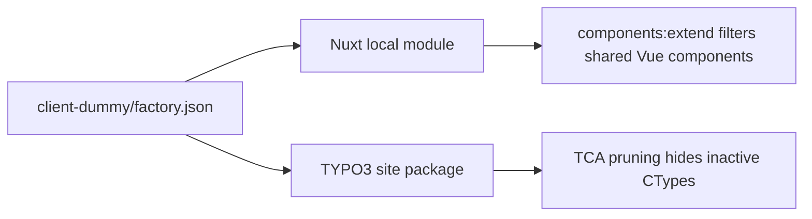

# Design Log #001 — client-dummy bootstrap

## Background

The project needs a client-specific setup in `client-dummy` that consumes the shared Factory Core from sibling directories:

- `factory-core/nuxt-layer`
- `factory-core/typo3-extension`

The goal is to keep the shared core generic while letting the client decide which content components are active through a single JSON contract.

## Problem

We need one source of truth that controls both runtimes:

- Nuxt should only auto-register active shared components so inactive Vue components are tree-shaken.
- TYPO3 should hide inactive Content Block content elements from editors.

The setup must stay local-first and consume the core via relative paths instead of published packages.

## Questions and Answers

### Q1. What is the activation contract?

**Answer:** `client-dummy/factory.json` is the contract.

```json
{
	"core_version": "1.0.0",
	"active_components": [
		"hero"
	]
}
```

Validation rules:

- `core_version`: required string
- `active_components`: required string array
- component keys use lowercase slug format like `hero`

### Q2. How are frontend and backend component names matched?

**Answer:** Both sides use the same slug key.

- Nuxt component file `Hero.vue` → `hero`
- Content Block folder `hero` → `hero`
- Content Block name `labor-digital/hero` → `hero`

### Q3. Where does client-specific logic live?

**Answer:** In the client project only.

- Frontend pruning logic lives in `client-dummy/frontend/modules/factory-components.ts`
- TYPO3 pruning logic lives in `client-dummy/backend/packages/client_sitepackage/ext_localconf.php`

The shared core must not be modified for client-specific activation behavior.

### Q4. Can TYPO3 fully unregister generated Content Block CTypes safely?

**Answer:** Not reliably as a general runtime strategy. The safe approach is to prune the backend UI by removing inactive CTypes from TCA select items and clearing their type configuration if present.

## Design

### Shared contract

`client-dummy/factory.json` is read by:

- Node in the Nuxt module
- PHP in the TYPO3 site package

Both runtimes normalize the JSON into the same shape:

```ts
type FactoryConfig = {
	core_version: string
	active_components: string[]
}
```

```php
/**
 * @return array{core_version:string,active_components:list<string>}
 */
function loadFactoryConfig(string $path): array
```

### Frontend design

`client-dummy/frontend/nuxt.config.ts` extends the shared layer through:

```ts
extends:
['../../factory-core/nuxt-layer']
```

The local module uses the `components:extend` hook to mutate the discovered component registry.

Filtering logic:

1. Read `../factory.json` from the frontend directory.
2. Build a `Set<string>` from `active_components`.
3. Only inspect components originating from `../../factory-core/nuxt-layer/components/T3/Content`.
4. Convert each component filename to a slug key.
5. Remove items whose slug is not active.

Good pattern ✅

```ts
Hero.vue
->
hero -> kept
when
"hero"
is
active
```

Bad pattern ❌

```ts
MyFancyCard.vue
->
myfancycard
```

Reason: PascalCase without delimiter support becomes ambiguous. Shared content components should use stable names that map cleanly to a slug.

### Backend design

`client-dummy/backend/composer.json` uses a path repository for the local TYPO3 extension:

```json
{
	"type": "path",
	"url": "../../factory-core/typo3-extension",
	"options": {
		"symlink": true
	}
}
```

The client site package reads `../factory.json`, scans `../../factory-core/typo3-extension/ContentBlocks/ContentElements`, derives inactive content types, and prunes TYPO3 backend options.

Planned CType mapping:

- Content Block folder `hero`
- Content Block name `labor-digital/hero`
- CType candidates checked in TCA: `hero`, `myagency_hero`, `my_agency_hero`, `my-agency_hero`

Pruning strategy:

1. Remove inactive items from `$GLOBALS['TCA']['tt_content']['columns']['CType']['config']['items']`
2. Remove inactive entries from `$GLOBALS['TCA']['tt_content']['types']` when present
3. Keep active entries untouched

This hides inactive items from editors and avoids changing the shared extension.



## Implementation Plan

### Phase 1 — Shared contract

- Create `client-dummy/factory.json`
- Seed it with `core_version: 1.0.0` and `active_components: ["hero"]`

### Phase 2 — Frontend bootstrap

- Create `client-dummy/frontend/package.json`
- Create `client-dummy/frontend/nuxt.config.ts`
- Create `client-dummy/frontend/app.vue`
- Create `client-dummy/frontend/modules/factory-components.ts`

### Phase 3 — Backend bootstrap

- Create `client-dummy/backend/composer.json`
- Create `client-dummy/backend/packages/client_sitepackage/composer.json`
- Create `client-dummy/backend/packages/client_sitepackage/ext_emconf.php`
- Create `client-dummy/backend/packages/client_sitepackage/ext_localconf.php`
- Create `client-dummy/backend/packages/client_sitepackage/ext_tables.php`

### Phase 4 — Runtime pruning

- Frontend removes inactive layer components during `components:extend`
- Backend removes inactive CTypes from backend selectors and type definitions

## Examples

### Example: active component

Config:

```json
{
	"core_version": "1.0.0",
	"active_components": [
		"hero"
	]
}
```

Expected result:

- Nuxt keeps `Hero.vue`
- TYPO3 shows the `hero` content element

### Example: inactive component

Config:

```json
{
	"core_version": "1.0.0",
	"active_components": []
}
```

Expected result:

- Nuxt removes `Hero.vue` from discovered shared components
- TYPO3 removes the matching CType from backend selection lists

## Trade-offs

- **JSON contract is simple**: easy to share across Node and PHP, but schema validation is manual.
- **Path repositories are convenient**: ideal for local development, but relative paths must remain stable in CI and deployment.
- **TCA pruning is safe**: it hides inactive backend options without patching core registration internals, but it is not a full uninstall mechanism for already-created records.
- **Filename-to-slug mapping is lightweight**: no extra registry needed, but naming conventions must remain strict.

## Implementation Results

- Created `client-dummy/factory.json` as the shared activation contract.
- Bootstrapped `client-dummy/frontend` with `package.json`, `nuxt.config.ts`, `app.vue`, `pages/index.vue`, and `modules/factory-components.ts`.
- Configured `client-dummy/frontend/nuxt.config.ts` to extend `../../factory-core/nuxt-layer` and register the local pruning module.
- Implemented frontend pruning with the `components:extend` hook so inactive shared components are removed from the discovered component registry.
- Bootstrapped `client-dummy/backend/composer.json` with local path repositories for `../../factory-core/typo3-extension` and `packages/client_sitepackage`.
- Created `client-dummy/backend/packages/client_sitepackage` with `composer.json`, `ext_emconf.php`, `ext_localconf.php`, and `ext_tables.php`.
- Implemented TYPO3 backend pruning in `ext_localconf.php` by reading `client-dummy/factory.json`, scanning shared Content Blocks, deriving CType candidates, and hiding inactive entries via `ExtensionManagementUtility::addPageTSConfig()`.
- Deviation from the original ideal: TYPO3 pruning is implemented as backend hiding through Page TSconfig instead of hard unregistering generated Content Block records, because that is the safer runtime API boundary for a client site package.
- Tests not run in this task. Validation should be done with `npm install && npm run dev` in `client-dummy/frontend` and `composer install` in `client-dummy/backend`.
