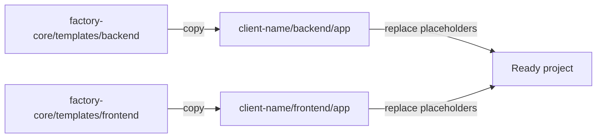

# Design Log #002 — Boilerplate Templates for Client Projects

## Background

The Factory monorepo needs reusable boilerplate templates that the CLI can copy to bootstrap new client projects. Currently, `client-dummy` was hand-crafted (see Design Log #001). We need to extract this into generic templates with `{{PLACEHOLDER}}` tokens so the CLI can stamp out new clients automatically.

The templates live at `factory-core/templates/backend` and `factory-core/templates/frontend`.

## Problem

Every new client project requires the same scaffolding:

- Docker setup (docker-compose, Dockerfile, .env, opt scripts)
- TYPO3 backend with composer, sitepackage, site config, system config
- Nuxt frontend with package.json, nuxt.config, Tailwind/UI theming, factory-components module
- The `factory.json` activation contract
- lab-cli boilerplate metadata

Manually copying and renaming from `client-dummy` is error-prone. A template directory with placeholder tokens solves this.

## Questions and Answers

### Q1. What placeholders are needed?

**Answer:** The following placeholders cover all client-specific values:

| Placeholder | Example Value | Used In |
|---|---|---|
| `{{PROJECT_NAME}}` | `client-acme` | composer name, package name, container names, descriptions |
| `{{PROJECT_NAME_SLUG}}` | `client-acme` | file paths, env vars (hyphenated) |
| `{{PROJECT_NAME_UNDERSCORE}}` | `client_acme` | PHP namespaces, extension keys |
| `{{PROJECT_LABEL}}` | `Client Acme` | human-readable titles |
| `{{APP_DOMAIN_BACKEND}}` | `lab-acme-bac.labor.systems` | backend .env |
| `{{APP_DOMAIN_FRONTEND}}` | `lab-acme-fro.labor.systems` | frontend .env |
| `{{DOPPLER_PROJECT}}` | `lab_acme_app` | Doppler config |

### Q2. Should the template mirror the exact `client-dummy/backend/app/` nesting?

**Answer:** Yes. The template structure mirrors the `app/` directory layout exactly so the CLI can copy it directly into `client-{name}/backend/app/` and `client-{name}/frontend/app/`.

### Q3. Should the `ext_localconf.php` pruning logic be in the template or in factory-core?

**Answer:** It stays in the template (client sitepackage). Per Design Log #001, client-specific pruning logic lives in the client project. The shared core must not be modified for client-specific activation behavior.

### Q4. How do Docker volume mounts reference factory-core?

**Answer:** Via relative paths from the client project root. The template uses `${APP_ROOT_DIR}../../../factory-core/` which resolves correctly when the client lives at `client-{name}/backend/app/` within the monorepo.

## Design

### Template directory structure

```
factory-core/templates/
  backend/
    .dockerignore
    .env.app.template
    .env.template
    .gitattributes
    .gitignore
    docker-compose.yml
    Dockerfile
    lab.boilerplate.json
    opt/
      bootstrap.sh
      build.sh
      development.sh
      directories.sh
      permissions.sh
    src/
      composer.json
      factory.json
      config/
        sites/main/config.yaml
        system/additional.php
        system/settings.php
      packages/
        client_sitepackage/
          composer.json
          ext_emconf.php
          ext_localconf.php
          ext_tables.php
      public/
        index.php
  frontend/
    .dockerignore
    .env.app.template
    .env.template
    .gitattributes
    .gitignore
    docker-compose.yml
    Dockerfile
    lab.boilerplate.json
    opt/
      bootstrap.sh
      build.sh
      development.sh
      directories.sh
      permissions.sh
    src/
      app.config.ts
      app.vue
      factory.json
      nuxt.config.ts
      package.json
      tailwind.config.ts
      modules/
        factory-components.ts
      pages/
        index.vue
```

### Placeholder strategy

The CLI performs simple string replacement on all text files after copying:



### Key design decisions

1. **Relative paths for factory-core**: Docker volumes and composer repositories use relative paths from the client project root. This works for local dev. For CI/deployment, the CLI or pipeline can override these.

2. **Nuxt layer extends path**: `extends: ['../modules/nuxt-layer']` — the Docker volume mounts the factory-core nuxt-layer to `/var/www/modules/nuxt-layer`, matching the existing pattern.

3. **factory.json starts empty**: New projects start with `active_components: []` so nothing is enabled by default.

4. **Settings/additional.php are generic**: They use environment variables for all secrets and connection details, no client-specific values hardcoded.

5. **ext_localconf.php is copied verbatim**: The pruning logic is generic — it reads factory.json and scans content blocks. No placeholders needed in the logic itself.

## Implementation Plan

### Phase 1 — Backend template

Create all files under `factory-core/templates/backend/` with `{{PROJECT_NAME}}`, `{{PROJECT_NAME_UNDERSCORE}}`, `{{PROJECT_LABEL}}`, `{{APP_DOMAIN_BACKEND}}`, and `{{DOPPLER_PROJECT}}` placeholders where client-specific values appear.

### Phase 2 — Frontend template

Create all files under `factory-core/templates/frontend/` with `{{PROJECT_NAME}}`, `{{PROJECT_LABEL}}`, `{{APP_DOMAIN_FRONTEND}}`, and `{{DOPPLER_PROJECT}}` placeholders.

### Phase 3 — Validation

Verify the template structure matches `client-dummy` and all client-specific strings are replaced with placeholders.

## Trade-offs

- **Simple string replacement**: Easy to implement in CLI, but no conditional logic. If a client needs a different DB engine or extra services, they modify after scaffolding.
- **Relative paths**: Work perfectly in the monorepo, but break if the directory structure changes. The CLI should validate the monorepo layout.
- **Empty active_components**: Safe default, but requires the developer to manually enable components after scaffolding.
- **No README template**: The README would need significant customization per client. Better to generate it in the CLI with richer logic than a simple template.

## Implementation Results

### Files created (34 total)

**Backend template** (`factory-core/templates/backend/`) — 19 files:
- `.dockerignore`, `.env.app.template`, `.env.template`, `.gitattributes`, `.gitignore`
- `docker-compose.yml`, `Dockerfile`, `lab.boilerplate.json`
- `opt/bootstrap.sh`, `opt/build.sh`, `opt/development.sh`, `opt/directories.sh`, `opt/permissions.sh`
- `src/composer.json`, `src/factory.json`
- `src/config/sites/main/config.yaml`, `src/config/system/additional.php`, `src/config/system/settings.php`
- `src/packages/client_sitepackage/composer.json`, `ext_emconf.php`, `ext_localconf.php`, `ext_tables.php`
- `src/public/index.php`

**Frontend template** (`factory-core/templates/frontend/`) — 17 files:
- `.dockerignore`, `.env.app.template`, `.env.template`, `.gitattributes`, `.gitignore`
- `docker-compose.yml`, `Dockerfile`, `lab.boilerplate.json`
- `opt/bootstrap.sh`, `opt/build.sh`, `opt/development.sh`, `opt/directories.sh`, `opt/permissions.sh`
- `src/package.json`, `src/nuxt.config.ts`, `src/app.config.ts`, `src/tailwind.config.ts`
- `src/app.vue`, `src/factory.json`
- `src/modules/factory-components.ts`
- `src/pages/index.vue`

### Placeholders used

| Placeholder | Files |
|---|---|
| `{{PROJECT_NAME}}` | backend `.env.template`, backend `src/composer.json`, frontend `.env.template`, frontend `src/package.json` |
| `{{PROJECT_LABEL}}` | backend `src/config/system/settings.php`, backend `src/packages/client_sitepackage/composer.json`, backend `src/packages/client_sitepackage/ext_emconf.php`, frontend `src/pages/index.vue` |
| `{{APP_DOMAIN_BACKEND}}` | backend `.env.template` |
| `{{APP_DOMAIN_FRONTEND}}` | frontend `.env.template` |
| `{{DOPPLER_PROJECT}}` | backend `.env.template`, frontend `.env.template` |
| `{{TYPO3_ENCRYPTION_KEY}}` | backend `src/config/system/settings.php` |

### Deviations from design

- Added `{{TYPO3_ENCRYPTION_KEY}}` placeholder in `settings.php` — the original `client-dummy` had a hardcoded key. The template uses a placeholder so the CLI can generate a unique key per project.
- Removed `vhs` and `redirects` extension config from `settings.php` — these were client-dummy-specific and not part of the base Factory stack.
- Removed the `test` service from backend `docker-compose.yml` — tests are excluded per user request.
- `pages/index.vue` uses `{{PROJECT_LABEL}}` as a simple placeholder page title. In production, this page would be replaced by TYPO3-driven content.
- `factory.json` starts with empty `active_components: []` instead of `["hero"]` — new projects should opt-in to components explicitly.
