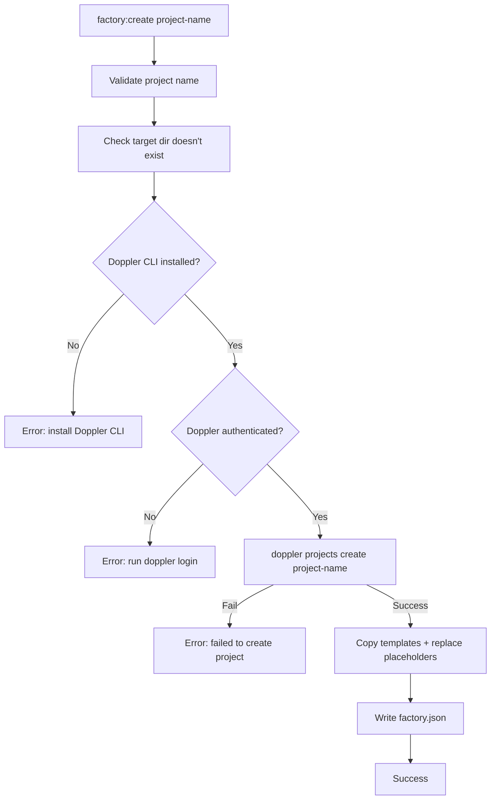

# Design Log #003 — Doppler Integration in factory:create

## Background

The Factory boilerplate templates (see Design Log #002) include `{{DOPPLER_PROJECT}}` placeholders in `.env.template` files for both backend and frontend. The `DOPPLER_PROJECT` and `DOPPLER_CONFIG` env vars are used by the lab-cli Docker init flow (`DockerAppInit.ts`) to generate service tokens during `lab up`.

However, the `lab factory:create` command only replaced `{{PROJECT_NAME}}` — leaving `{{DOPPLER_PROJECT}}` as a raw placeholder. More critically, no Doppler project was being created, so even after manual replacement the Docker init would fail because the project didn't exist in Doppler.

## Problem

When scaffolding a new client project via `lab factory:create`:

1. The Doppler project must exist before `lab up` can generate service tokens
2. The `{{DOPPLER_PROJECT}}` placeholder in `.env.template` files must be replaced with the actual project identifier
3. If Doppler CLI is unavailable or unauthenticated, the scaffolding should fail early rather than produce a broken project

## Questions and Answers

### Q1. What environments should be created?

**Answer:** Doppler auto-creates three default environments when a project is created: `dev` (Development), `stg` (Staging), `prd` (Production). These defaults are sufficient — no custom environment creation needed.

### Q2. What naming convention for the Doppler project?

**Answer:** Use the project name directly (e.g., `client-acme` → Doppler project `client-acme`). The original template design assumed `lab_acme_app` format, but the simpler direct mapping was chosen for clarity.

### Q3. Should Doppler be optional or required?

**Answer:** Required. If the Doppler CLI is not installed or not authenticated, `factory:create` fails with a clear error message before any files are created. This prevents scaffolding projects that can't run their Docker setup.

## Design

### Execution flow



### Placeholder replacement

The `replacePlaceholders` method was refactored from single-placeholder to a generic replacement system:

```ts
const replacements: Record<string, string> = {
    '{{PROJECT_NAME}}': projectName,
    '{{DOPPLER_PROJECT}}': projectName
};
```

This makes it trivial to add more placeholders (e.g., `{{PROJECT_LABEL}}`, `{{APP_DOMAIN_BACKEND}}`) in future iterations.

### Doppler API additions

Two methods added to `Doppler.ts`:

- `createProject(projectName)` — runs `doppler projects create "<name>" --json`
- `createEnvironment(projectName, envName, slug?)` — runs `doppler environments create "<name>" "<slug>" -p "<project>" --json` (available for future use, not called by `factory:create`)

### Error handling

All Doppler errors are caught before directory creation. The error output follows the existing `isJson` conditional pattern:
- JSON mode: `{ "status": "error", "message": "..." }`
- Interactive mode: `chalk.red(message)`

## Implementation Plan

### Phase 1 — Doppler.ts

Add `createProject()` and `createEnvironment()` methods to `/Users/kim/Work/Labor/Lab-Cli/lab-cli/src/Classes/Api/Doppler.ts`.

### Phase 2 — FactoryCreateCommand.ts

1. Import `Doppler` class
2. Add Doppler checks + project creation before directory scaffolding
3. Refactor `replacePlaceholders` to support multiple placeholder tokens

### Phase 3 — Verification

Run `test-pipeline.sh` and verify:
- Doppler project exists via `doppler projects get -p <name>`
- `.env.template` files contain resolved `DOPPLER_PROJECT=<name>`

## Trade-offs

- **Doppler as hard dependency**: Prevents scaffolding without Doppler, but avoids broken projects. Teams without Doppler would need to remove or bypass this check.
- **Project name = Doppler project name**: Simpler than a derived format, but means project names must be valid Doppler identifiers.
- **No environment customization**: Relies on Doppler defaults (dev/stg/prd). If custom environments are needed later, the `createEnvironment()` method is already available.
- **Doppler project created before files**: If file copying fails after Doppler project creation, an orphaned Doppler project remains. Acceptable because: (a) it's idempotent on retry after cleanup, (b) orphaned projects are harmless and easily deleted.

## Implementation Results

### Files modified

**Lab-Cli:**
- `src/Classes/Api/Doppler.ts` — added `createProject()` and `createEnvironment()` methods
- `src/Classes/Command/FactoryCreateCommand.ts` — Doppler integration + generic placeholder replacement

### Deviations from design

- Originally planned to create 3 custom environments (dev, stage, prod). Discovered that Doppler auto-creates default environments (dev/stg/prd) on project creation, so environment creation was removed entirely.
- The `createEnvironment()` method was still added to `Doppler.ts` for future use but is not called by `factory:create`.

### Bug fix (unrelated but discovered during testing)

- `FactoryAddCommand.execute()` had an argument-passing bug: it expected `componentName` as a direct parameter, but `CommandHandler` passes the Commander `Command` object first. Fixed to use `cmd.args[0]` like `FactoryCreateCommand` does. (See lab-cli Design Log #4.)
