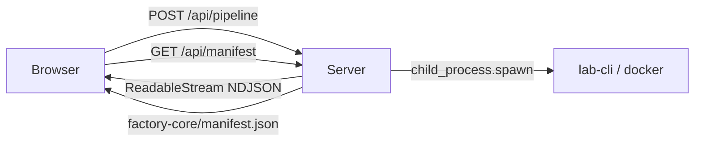

# Design Log #004 — Pipeline App (SvelteKit)

## Background

The Factory project uses `test-pipeline.sh` — a bash script that runs an E2E test of the full scaffolding and component pipeline (Phases 0–3: teardown, scaffolding, component injection, Docker bootstrapping). The script has a polished terminal UI with typewriter effects, colored output, and ASCII art, but is difficult to configure, observe, and extend.

Key pain points with the bash approach:
- Configuration requires editing the script directly
- No way to pick components visually (must edit the `COMPONENTS_TO_TEST` array)
- Phase 3 requires switching to the terminal for `sudo -v` pre-authentication
- The Install Tool Password is stored as a pre-hashed Argon2id string — unintuitive to change
- No persistent history of which config was used for a run

## Problem

Replace `test-pipeline.sh` with a web-based pipeline runner that:
1. Provides a visual UI for configuring and running the pipeline
2. Streams real-time command output to the browser
3. Handles sudo authentication within the app (no terminal switching)
4. Hashes the Install Tool Password on the server (user enters plaintext)
5. Shows a success page with frontend/backend URLs and login credentials

## Design

### Tech stack

- **SvelteKit 2** (Svelte 5) — server routes for process spawning + client UI in one framework
- **Tailwind CSS v4** — via `@tailwindcss/vite` plugin, no PostCSS config
- **TypeScript 5**
- **Lucide icons** — `lucide-svelte` for UI icons (Eye/EyeOff, RefreshCw, ArrowLeft)
- **svelte-toast** — `@zerodevx/svelte-toast` for success/error/info notifications
- **Zero runtime deps** beyond the above — `child_process` is built-in Node

### Architecture



- **Streaming**: POST to `/api/pipeline` returns a `ReadableStream` of newline-delimited JSON `StepEvent` objects. Client reads via `response.body.getReader()`. No WebSocket library needed.
- **Concurrency**: Module-level mutex — only one pipeline at a time (409 on overlap).
- **Working directories**: All paths computed as absolutes. Each `spawn()` gets `{ cwd }` — no `process.chdir()`.

### Two-slide UI

```
Slide 1: Configuration          Slide 2: Pipeline Execution
┌──────────────────────┐        ┌──────────────────────┐
│ Banner               │  ───>  │ ← Configuration      │
│ Config Form          │        │ Phase 0: Teardown  ✔ │
│   - Project name     │        │ Phase 1: Scaffolding ◉│
│   - Components [chips]│       │ Phase 2: Injection  ○ │
│   - Phase 3 toggle   │        │ Phase 3: Docker    ○ │
│   - Sudo password    │        │                      │
│   - Secrets (collapsed)│      │ Success section      │
│ [Run Pipeline]       │        │   URLs + credentials │
└──────────────────────┘        └──────────────────────┘
```

- Clicking "Run Pipeline" slides to the execution view (CSS `translateX` transition, 500ms)
- Each phase auto-collapses when it finishes (passed or failed)
- Back arrow returns to config (disabled while running)

### Password & secret handling

- **Admin Password / Install Tool Password / Sudo Password**: Toggle visibility via Eye/EyeOff icons
- **Encryption Key**: Auto-generate button produces a random 64-char hex key via `crypto.getRandomValues()`
- **Install Tool Password**: User enters plaintext. The server hashes it to Argon2id via a PHP one-liner (`password_hash()`) before passing to the executor
- **Sudo Password**: Piped to `sudo -S -v` via stdin before Phase 3. Never persisted to localStorage
- **Config persistence**: Saved to `localStorage` excluding `sudoPassword`

### Validation

- Phase 3 checkbox shows a sudo password field
- "Run Pipeline" button is disabled when Phase 3 is enabled but no sudo password is provided

### Toast notifications

Using `@zerodevx/svelte-toast`, bottom-right, monospace, pause-on-hover:
- ✅ Green: phase passed, pipeline complete
- ❌ Red: phase failed, pipeline error, 409 conflict (6s duration)
- ℹ️ Dark/cyan: pipeline cancelled

## Implementation Plan

### Phase 1 — Scaffold SvelteKit app
Create `pipeline-app/` at repo root with package.json, svelte.config.js, vite.config.ts, tsconfig.json, app.html, app.css.

### Phase 2 — Types & config
- `src/lib/pipeline/types.ts` — PipelineConfig, StepEvent, PhaseInfo, Manifest types
- `src/lib/pipeline/config.ts` — default values matching `test-pipeline.sh`

### Phase 3 — Pipeline executor
- `src/lib/pipeline/executor.ts` — port all 4 phases from bash to async TypeScript using `child_process.spawn`
- `src/lib/pipeline/assertions.ts` — file-exists and json-contains checks
- `src/lib/pipeline/hash.ts` — Argon2id hashing via PHP subprocess

### Phase 4 — API routes
- `POST /api/pipeline` — accepts config, hashes password, streams StepEvents
- `DELETE /api/pipeline` — cancels running pipeline via AbortController
- `GET /api/manifest` — reads factory-core/manifest.json

### Phase 5 — UI components & pages
- Banner, ConfigForm, ComponentPicker, PasswordInput, PhaseCard, StepLine
- Two-slide layout in `+page.svelte`
- Toast integration in `+layout.svelte`

## Trade-offs

- **PHP for Argon2id hashing**: Node.js lacks native Argon2 support. Using PHP is pragmatic since the project already requires PHP (TYPO3 backend). Alternative: add an `argon2` npm package — rejected to keep zero runtime deps.
- **Sudo via stdin pipe**: Less secure than `sudo -v` in a terminal (password passes through Node process memory), but acceptable for a local dev tool. The password is never persisted.
- **Single-page slides vs. SvelteKit routes**: Using CSS slide transitions instead of separate routes avoids losing state between pages. The pipeline state (phases, steps, output) lives in component state — navigating away would destroy it.
- **No persistent run history**: Config saves to localStorage but run results are ephemeral. Acceptable for a dev tool — if history is needed later, could write results to a JSON file.

## Implementation Results

### Files created

**`pipeline-app/`** (new SvelteKit app at repo root):

```
pipeline-app/
├── package.json, svelte.config.js, vite.config.ts, tsconfig.json
├── src/
│   ├── app.html, app.css
│   ├── lib/
│   │   ├── pipeline/
│   │   │   ├── types.ts, config.ts, executor.ts, assertions.ts, hash.ts
│   │   ├── components/
│   │   │   ├── Banner.svelte, ConfigForm.svelte, ComponentPicker.svelte
│   │   │   ├── PasswordInput.svelte, PhaseCard.svelte, StepLine.svelte
│   │   └── toast.ts
│   └── routes/
│       ├── +layout.svelte, +page.svelte
│       └── api/pipeline/+server.ts, api/manifest/+server.ts
```

### Deviations from original bash script

- **Install Tool Password**: Stored as plaintext in config (was pre-hashed Argon2id in bash). Server hashes before use.
- **Sudo handling**: Done in-app via `sudo -S -v` with stdin pipe (was manual `sudo -v` in terminal).
- **No typewriter effect**: The bash script's character-by-character typing animation was not ported. The terminal box aesthetic is preserved via CSS styling instead.
