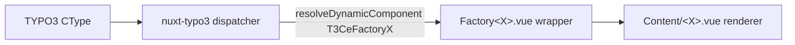

# Design Log #006 — Ce Registration Hardening

## Background

The Factory frontend uses a chain of indirection to render TYPO3 Content Elements:



The dispatcher (`nuxt-typo3`) maps a CType string to a component name like `T3CeFactoryPagecontact` and resolves it via Vue's `resolveDynamicComponent()`. That resolver only sees components registered via `app.component()` — Nuxt's auto-imports alone are not enough in this codepath, even with `addComponentsDir({ global: true })`.

For this reason a plugin file at [factory-core/nuxt-layer/plugins/register-ce.ts](factory-core/nuxt-layer/plugins/) historically maintained a manual list of imports:

```ts
import FactoryAccordion from '../components/T3/Ce/FactoryAccordion.vue'
// ... 14 more lines ...
const components = { FactoryAccordion, /* ... */ }
export default defineNuxtPlugin((nuxtApp) => {
  for (const [name, comp] of Object.entries(components)) {
    nuxtApp.vueApp.component(`T3Ce${name}`, comp)
    nuxtApp.vueApp.component(`LazyT3Ce${name}`, comp)
  }
})
```

## Problem

In commit a3ed2ab the section component library was rewritten and `PageContact` was added — but the matching `FactoryPagecontact` import was never added to `register-ce.ts`. The result was a silent failure mode: nuxt-typo3's `resolveDynamicComponent()` returned the raw string, the dispatcher fell through, and the page rendered the raw `content` prop as JSON. No error, no warning, just broken output that's easy to ship.

Two independent root causes made the bug possible:

1. **Manual registration list** in `plugins/register-ce.ts` — adding a Ce wrapper required two coordinated edits in two files. Easy to forget the second one.
2. **No build-time validation** that an `active_components` entry has a corresponding Ce wrapper. The existing `factory-components.ts` module already validated against the `Content/*.vue` side, but knew nothing about the `Ce/*.vue` side.

Either fix alone would have caught the PageContact case. Doing both is cheap and creates two independent layers of defense.

## Design

### Part 1 — Auto-generate the Ce plugin from a glob

Replace the manual `plugins/register-ce.ts` with build-time generation inside the existing [factory-core/nuxt-layer/lib/register-ce-global.ts](factory-core/nuxt-layer/lib/register-ce-global.ts) module. That module already calls `addComponentsDir` for the Ce/Content/Layout directories, so co-locating the plugin generation keeps the registration logic in one place.

Use `addPluginTemplate({ getContents })` from `@nuxt/kit`. At build time the module reads the Ce directory, sorts the wrappers, and emits a virtual plugin file in `.nuxt/factory-register-ce.mjs` with one `import` and one `app.component()` pair per wrapper. Nuxt picks the file up via `addPluginTemplate`'s implicit `addPlugin` call.

```ts
addPluginTemplate({
  filename: 'factory-register-ce.mjs',
  write: true,
  getContents() {
    const wrapperNames = readdirSync(ceDir)
      .filter((file) => file.endsWith('.vue'))
      .map((file) => file.replace(/\.vue$/, ''))
      .sort()

    const importLines = wrapperNames
      .map((name) => `import ${name} from ${JSON.stringify(`${ceDir}/${name}.vue`)}`)
      .join('\n')

    const entries = wrapperNames.map((name) => `  ${name}`).join(',\n')

    return `// AUTO-GENERATED by factory-ce-global module. Do not edit.
import { defineNuxtPlugin } from '#app'
${importLines}

const components = {
${entries}
}

export default defineNuxtPlugin((nuxtApp) => {
  for (const [name, comp] of Object.entries(components)) {
    nuxtApp.vueApp.component('T3Ce' + name, comp)
    nuxtApp.vueApp.component('LazyT3Ce' + name, comp)
  }
})
`
  }
})
```

A `builder:watch` hook restarts Nuxt in dev when a Ce wrapper is added or removed, so the generated list stays in sync without a manual restart:

```ts
nuxt.hook('builder:watch', async (event, watchedPath) => {
  if ((event !== 'add' && event !== 'unlink') || !watchedPath.endsWith('.vue')) return
  const normalized = watchedPath.replace(/\\/g, '/')
  if (!normalized.includes('/components/T3/Ce/') && !normalized.startsWith(ceDirNormalized)) return
  await nuxt.callHook('restart')
})
```

The manual `factory-core/nuxt-layer/plugins/register-ce.ts` is deleted.

### Part 2 — Build-time wrapper validation

Extend [test-client-auto/frontend/app/src/modules/factory-components.ts](test-client-auto/frontend/app/src/modules/factory-components.ts) (and the source-of-truth template at [factory-core/templates/frontend/src/modules/factory-components.ts](factory-core/templates/frontend/src/modules/factory-components.ts)) with a deterministic existence check.

For each entry in `factory.json`'s `active_components`, derive the expected Ce wrapper filename and `existsSync()` it against the layer's `components/T3/Ce/` directory. If any are missing, log a warning that names them and explains the failure mode (so it shows up in build logs without halting the build).

#### Naming convention

The wrapper filenames in `factory-core/nuxt-layer/components/T3/Ce/` follow the convention: first character preserved (uppercase), rest of the name lowercased, prefixed with `Factory`.

| Active component | Wrapper filename |
|------------------|------------------|
| `Accordion` | `FactoryAccordion.vue` |
| `PageContact` | `FactoryPagecontact.vue` |
| `PageHero` | `FactoryPagehero.vue` |
| `ButtonGroup` | `FactoryButtongroup.vue` |

```ts
function ceWrapperFileName(activeComponentName: string): string {
  const trimmed = activeComponentName.trim()
  if (trimmed.length === 0) return 'Factory'
  return `Factory${trimmed.charAt(0).toUpperCase()}${trimmed.slice(1).toLowerCase()}`
}
```

#### Validation

```ts
const missingCeWrappers = factoryConfig.active_components.filter((activeName) => {
  const wrapperPath = resolve(factoryLayerCePath, `${ceWrapperFileName(activeName)}.vue`)
  return !existsSync(wrapperPath)
})

if (missingCeWrappers.length > 0) {
  logger.warn(
    `Active components are missing Ce wrappers in the shared Nuxt layer ` +
    `(these will render as raw JSON in TYPO3): ${missingCeWrappers.join(', ')}. ` +
    `Expected files at ${factoryLayerCePath}/Factory<Name>.vue`
  )
}
```

Why a warning, not an error: the existing `unknownConfiguredComponents` check is also a warning. Build halts on missing dependencies feel disproportionate for a developer-experience guard, and leaving it as a warning matches the surrounding style.

## Examples

### ✅ Adding a new component (post-fix)

1. Add `Content/PageTestimonial.vue` and `Content/BasePageTestimonial.vue`.
2. Add `Ce/FactoryPagetestimonial.vue` (a thin wrapper, ~8 lines).
3. Add `PageTestimonial` to `factory.json` `active_components`.
4. Restart dev (or run `nuxt prepare`) — the generated `.nuxt/factory-register-ce.mjs` automatically includes the new wrapper.

No edits to `register-ce.ts` (it doesn't exist), no edits to `register-ce-global.ts`.

### ❌ Forgetting the wrapper (post-fix)

1. Add `Content/PageTestimonial.vue` and `Content/BasePageTestimonial.vue`.
2. Add `PageTestimonial` to `factory.json` — but forget the Ce wrapper file.
3. Run `nuxt prepare`:

```
[factory-components]  WARN  Active components are missing Ce wrappers in the
shared Nuxt layer (these will render as raw JSON in TYPO3): PageTestimonial.
Expected files at /var/www/modules/nuxt-layer/components/T3/Ce/Factory<Name>.vue
```

The bug is visible in the build log before any rendering happens.

## Trade-offs

| Pro | Con |
|-----|-----|
| Eliminates the manual import list — adding a wrapper requires zero registration edits | The generated plugin uses absolute paths from `readdirSync`, which is fine for build-time but unusual to read |
| Two independent guards (auto-generation + validation) — either alone catches the PageContact bug | Validation lives in client-side `factory-components.ts`, not the layer — every client gets the check via the template, but an existing client must regenerate to pick it up |
| `addPluginTemplate` is the canonical Nuxt mechanism for generated plugins, well-supported through HMR | `builder:watch` matches paths on a substring (`/components/T3/Ce/`) because watcher path semantics vary between absolute/relative |
| The generated plugin file lives in `.nuxt/`, which is gitignored — no committed artifacts | The naming convention (first char preserved, rest lowercased) is implicit in the filenames; documenting it in code is the only way to make it discoverable |

## Implementation Results

### Files changed

**Auto-generation:**
- [factory-core/nuxt-layer/lib/register-ce-global.ts](factory-core/nuxt-layer/lib/register-ce-global.ts) — added `addPluginTemplate` block and `builder:watch` hook
- [factory-core/nuxt-layer/plugins/register-ce.ts](factory-core/nuxt-layer/plugins/) — **deleted**

**Validation:**
- [test-client-auto/frontend/app/src/modules/factory-components.ts](test-client-auto/frontend/app/src/modules/factory-components.ts) — added `ceWrapperFileName()` helper, `factoryLayerCePath` resolution, and the missing-wrapper check
- [factory-core/templates/frontend/src/modules/factory-components.ts](factory-core/templates/frontend/src/modules/factory-components.ts) — same changes mirrored to the template so future scaffolds inherit them

### Verification (run inside `test-client-auto-frontend` container)

1. **Validation warning fires** — moved `FactoryPagecontact.vue` aside, ran `nuxt prepare`:
   ```
   [factory-components]  WARN  Active components are missing Ce wrappers in the shared Nuxt layer (these will render as raw JSON in TYPO3): PageContact. Expected files at /var/www/modules/nuxt-layer/components/T3/Ce/Factory<Name>.vue
   ```
   The auto-generated plugin also dropped `FactoryPagecontact` from its imports.

2. **Auto-registration of new wrappers** — created a throwaway `FactoryDummytest.vue`, ran `nuxt prepare`. The generated `.nuxt/factory-register-ce.mjs` picked up `FactoryDummytest` alongside the existing 15 wrappers with no edits to the plugin or module.

3. **Full clean build** — restored both files, ran `nuxt build` against test-client-auto. `Build complete!`, no `factory-components` warnings, all 15 wrappers in the generated plugin, `T3CeFactoryPagecontact` present in both `.output/server/chunks/build/server.mjs` and the client bundle.

### Deviations from design

None. The implementation matches the design as written.
