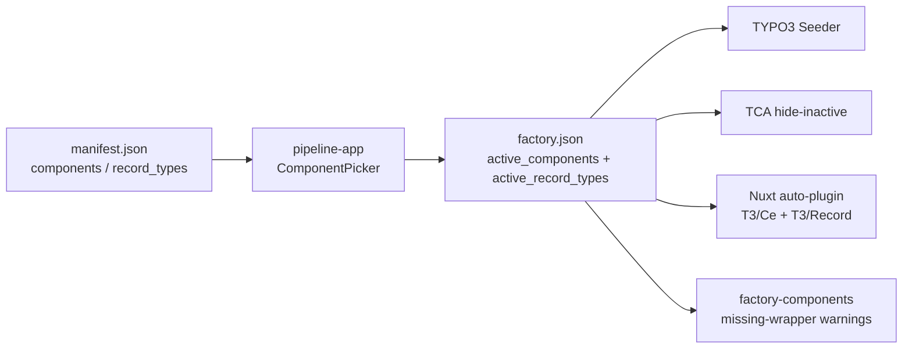

# 010 — Record Types + ReferenceList

## Background

Factory ships **Content Elements** — CTypes where each block owns its fields and renders itself from a `tt_content` row. Up to now there has been no concept of a reusable **record** (a Property, a News item, a Person…) that multiple UI components could display, and no registration surface for new record types beyond hard-coding. The Heckelsmüller Figma ([node 47:788](https://www.figma.com/design/XSf9bqe4tA6IwvRBYrNlUx?node-id=47-788)) introduces a "Referenzen – Unsere Projekte" pattern: a header row (eyebrow / title / description / top-right textlink) followed by a grid of project cards. Every card shares the same shape — image, red tag, bold title, grey address, divider, meta row (Fertig / Fläche / Einh.).

## Problem

- No way to model a first-class record (real-estate Property) with its own table, common fields, and a free-placeable detail-content area.
- No registration surface for new record types parallel to `active_components` — neither in the TYPO3 backend (seeder, TCA hiding) nor in the Nuxt frontend (auto-registered dispatcher) nor in the pipeline-app picker.
- No wrapper CE that can display records of arbitrary type. A naive approach (PropertyList, NewsList, PersonList as separate CEs) would duplicate header / layout / picker logic for every record type we ever add.

## Questions and Answers

1. **How many wrapper CEs should we ship for rendering records?**
   — One polymorphic `ReferenceList` with a `layout` select (grid | slider), `columns`, `aspect_ratio`, `record_type`, and selection mode. Handles Property today, News / Person tomorrow.

2. **How should a Property's "Content" tab hold free-placeable content blocks?**
   — Inline `tt_content` via `foreign_field` / `foreign_table_field` — the EXT:news pattern. Editors reuse every active Content Block inside the Property detail, and the frontend rendering path is the same one as for a regular page.

3. **How do editors pick which records show in a ReferenceList?**
   — Both. A `selection_mode` select toggles between a manual inline relation and an auto query (storage pid + filter + limit + order). Covers curated homepage features AND "all current listings" pages.

4. **How should `manifest.json` distinguish components from record types?**
   — Split top-level into `{ components, record_types }`. Keeps the pipeline-app picker UI honest and avoids silently breaking any code iterating manifest keys.

5. **Can Content Blocks' `Relation` type do IRRE (`foreign_field`) directly?**
   — No — it emits `group/db`. We keep the field in `config.yaml` for schema clarity and then override it in `Configuration/TCA/Overrides/` to the `inline` type. Matches what EXT:news does.

## Design

### Architecture



Every surface that consumes component info grows a symmetric path for record types.

### Runtime path (ReferenceList → Property card)

```mermaid
flowchart LR
  Editor[Editor selects 3 properties<br/>in ReferenceList CE]
  CT[tt_content row<br/>CType=factory_referencelist]
  DP[ReferenceListProcessor<br/>resolves UIDs → JSON]
  Wire["content.records[]<br/>{ _record_type, uid, title, tag, … }"]
  RL[ReferenceList.vue grid/slider]
  Disp["resolveDynamicComponent<br/>T3RecordFactory&lt;Type&gt;"]
  FP[FactoryProperty.vue wrapper]
  BP[BaseProperty.vue parse]
  PV[Property.vue card render]

  Editor --> CT --> DP --> Wire --> RL --> Disp --> FP --> BP --> PV
```



### factory.json + manifest.json

`factory-core/manifest.json` splits to:

```json
{
  "components":  { "PageHero": { … }, "ReferenceList": { "version": "1.0.0", "npm_dependencies": ["@splidejs/vue-splide","@iconify/vue"], "nuxt_ui": false } },
  "record_types": { "Property":  { "version": "1.0.0", "typo3_table": "tx_factorycore_property", "nuxt_ui": false } }
}
```

Every client's `factory.json` gains `active_record_types: []` alongside `active_components`. Readers default the missing key to `[]` so existing clients keep booting.

### Property record block

New tree at `factory-core/typo3-extension/ContentBlocks/RecordTypes/property/` with `config.yaml` declaring two Tabs:

- **Common tab**: title / slug / teaser / listing_type (buy|rent) / status / tag (7 presets) / tag_custom / address_{street,zip,city,country} / price (nullable — null renders "Preis auf Anfrage") / price_type / area_m2 / rooms / units / year_built / year_completed / hero_image / gallery.
- **Content tab**: one `content_elements` field — declared as `Relation: tt_content` in the config but overridden in `Configuration/TCA/Overrides/tx_factorycore_property.php` to the IRRE shape:

```php
'content_elements' => ['config' => [
    'type' => 'inline',
    'foreign_table' => 'tt_content',
    'foreign_field' => 'tx_factorycore_property_parent',
    'foreign_table_field' => 'tx_factorycore_property_parent_table',
    'foreign_sortby' => 'sorting',
]]
```

Matching passthrough columns go on `tt_content` + schema SQL in the extension's `ext_tables.sql`.

`SeedData.yaml` ships three demo properties matching the Figma: Weingut zum Mehrfamilienhaus (MFH, 4 units), Einfamilienhaus Bodenheim, Doppelhaus Nackenheim (price: null).

### ReferenceList content element

`factory-core/typo3-extension/ContentBlocks/ContentElements/reference_list/`:

- Header fields copied from `text_slider` (eyebrow / eyebrow_decoration / eyebrow_color / title / description / text_align / buttons).
- Layout fields: `layout` (grid|slider), `columns` (2|3|4), `aspect_ratio`, slider-only toggles (`show_arrows` etc. with displayCond).
- `record_type` select populated via `itemsProcFunc` that reads `active_record_types` from factory.json — so the dropdown always reflects what's turned on.
- `selection_mode` (manual|auto) toggles two field groups via displayCond: a per-record-type `records_<slug>` Relation field (manual) versus `auto_storage_pid` + `auto_filter_*` + `auto_limit` + `auto_order` (auto).
- A `Configuration/TCA/Overrides/tt_content.php` pass emits `records_<slug>` columns for every active record type beyond Property, so onboarding a new record type doesn't require editing `reference_list/config.yaml`.

### Backend wire format (ReferenceListProcessor)

A TypoScript DataProcessor at `Classes/DataProcessing/ReferenceListProcessor.php` resolves the selected UIDs (manual picks or auto query) and serialises each to a JSON shape that the `parseFile` / `unwrapSelect` helpers already consume:

```json
{
  "_record_type": "property", "uid": 42,
  "title": "Weingut zum Mehrfamilienhaus", "tag": ["mfh"],
  "listing_type": ["buy"], "price": "1200000.00", "price_type": ["total"],
  "area_m2": "420.00", "rooms": "12.00", "units": 4,
  "year_completed": 2024,
  "hero_image": [ { "publicUrl": "/fileadmin/...", "properties": { "alternative": "...", "width": 1600, "height": 900, "mimeType": "image/jpeg" } } ],
  "address_street": "...", "address_zip": "...", "address_city": "..."
}
```

Manual and auto produce the same array shape; only UID resolution differs.

### Nuxt frontend

- `components/T3/Record/FactoryProperty.vue` — 7-line wrapper, sibling to `T3/Ce/Factory*`. Takes `record` + `variant` props.
- `components/T3/Content/BaseProperty.vue` — parses the record JSON into `uiProps` via the shared helpers (`parseFile`, `unwrapSelect`). `tag_custom` takes precedence over the tag select.
- `components/T3/Content/Property.vue` — card variant matches Figma (220px image area, red tag pill, bold title, grey address, border-b divider, 3-column meta row with FERTIG / FLÄCHE / EINH.). Detail variant stacks hero + gallery + teaser + `content_elements[]` loop (dispatched via `resolveDynamicComponent('T3Ce' + pascal(ctype.replace(/^factory_/, '')))`).
- `components/T3/Content/{BaseReferenceList,ReferenceList}.vue` — header + grid/slider branches. Each cell: `<component :is="resolveDynamicComponent('T3RecordFactory' + pascal(r._record_type))" :record="r" variant="card" />`. Slider reuses the Splide options pattern from TextSlider.
- `components/T3/Ce/FactoryReferencelist.vue` — CType wrapper.

### Nuxt auto-plugin + validation

`lib/register-ce-global.ts` gains a symmetric `addPluginTemplate` that globs `components/T3/Record/*.vue` and emits `factory-register-record.mjs`. `builder:watch` restarts on record-dir changes. `templates/frontend/src/modules/factory-components.ts` (and its test-client-auto mirror) gains a `missingRecordWrappers` check with the same warning pattern as `missingCeWrappers`.

### Seeder + TCA hiding

`ContentBlockSeeder.php` grows:

```php
public function getRecordBlockBasePath(): string
public function discoverRecordTypes(): array
public function getActiveRecordTypes(): ?array
public function buildRecordDataHandlerRecord(string $dir, int $pid, int $sorting, string $newId): ?array
```

`readConfigYaml` / `readSeedData` take a `bool $isRecord` flag. `InitSeederCommand` adds a `Records` folder page (doktype 254) under Homepage and calls `seedRecordTypeContent()` which batches one DataHandler run per record type's `SeedData.yaml` list. `client_sitepackage/ext_localconf.php` gets a symmetrical pass that hides inactive record-type tables:

```php
$GLOBALS['TCA'][$table]['ctrl']['hideTable'] = true;
```

### Pipeline-app

- `src/lib/pipeline/types.ts` — `Manifest = { components, record_types }`; `PipelineConfig.activeRecordTypes: string[]`.
- `ComponentPicker.svelte` — renders a second "Record Types" picker block below the component picker; emits `{ components, recordTypes }`.
- `ConfigForm.svelte` — passes both selections through.
- Pipeline executor — writes `active_record_types` into the generated `factory.json`.

### Playground stories (per #008)

- `playground/stories/property.story.ts` — controls for every common field + `variant` (card|detail). `buildContent` returns the record wire shape.
- `playground/stories/reference-list.story.ts` — controls for layout / columns / aspect / header + a `records` array control. Presets: "Grid / 3 columns / 3 properties" (the Figma) + "Slider / 4 properties".

## Implementation Plan

Phases in implementation order (each phase ends with the component working end-to-end before moving on):

1. **Manifest + factory.json contract**: split `manifest.json`; update every consumer (pipeline-app types/picker/executor, seeder, ext_localconf, factory-components module + template). Add `active_record_types: []` to all `factory.json` files and to `test-client-auto/factory.json`.
2. **Property TYPO3 block**: config.yaml, SeedData.yaml, DESIGNER_BRIEF.md, TCA override for IRRE, ext_tables.sql pointer columns.
3. **Seeder wiring**: `ContentBlockSeeder` record-path methods, `InitSeederCommand` Records folder + seed pass.
4. **TCA hiding**: ext_localconf.php record-table hide loop.
5. **ReferenceList TYPO3 block**: config.yaml (header + layout + manual/auto fields), ItemsProcFunc, dynamic per-record-type `records_<slug>` TCA override, DataProcessor + TypoScript wiring.
6. **Nuxt auto-plugin** for `T3/Record/*`: `register-ce-global.ts` extension + watch guard; `factory-components.ts` validation.
7. **Property Nuxt components**: FactoryProperty wrapper, BaseProperty parser, Property card/detail renderer.
8. **ReferenceList Nuxt components**: BaseReferenceList parser, ReferenceList grid/slider renderer, FactoryReferencelist CE wrapper. Lift `useSplideOptions` out of TextSlider into a shared composable.
9. **Pipeline-app**: type extension, ComponentPicker second section, ConfigForm, executor.
10. **Playground stories**: property + reference-list.

## Examples

### Adding a second record type (e.g., News) after this ships

1. Drop `ContentBlocks/RecordTypes/news/config.yaml` + `SeedData.yaml`.
2. Add `Configuration/TCA/Overrides/tx_factorycore_news.php` if you need inline content on the News detail (optional — many record types won't).
3. Add `News` to `active_record_types` in `factory.json`.
4. Create `components/T3/Record/FactoryNews.vue` + `Content/BaseNews.vue` + `Content/News.vue`.
5. Restart Nuxt; `nuxt prepare` emits no warnings.

No edits to ReferenceList, seeder, pipeline-app, or any registration wiring — the record-type itemsProcFunc picks up the new type automatically, and the TCA override emits `records_news` automatically.

### Tag override on a Property

- Editor picks `tag: NEUBAU` from the select, then types `"NEUBAU & UMBAU"` into `tag_custom`. The card shows the free-text value (matches the first Figma card). `BaseProperty` resolves `tag_custom || unwrapSelect(tag, '')`.

### Price-on-request

- Editor leaves `price` empty. Backend emits `"price": null`. `BaseProperty` sees `price: null` and the card displays "Preis auf Anfrage" in place of a formatted number.

## Trade-offs

- ✅ **One polymorphic `ReferenceList`** vs. rejected: separate Grid/Slider CEs or per-record-type `PropertyList` / `NewsList` CEs. Pros: single place to maintain header + picker + layout; new record types get listing UI for free. Cons: `records_<slug>` field has to be generated per type via a TCA override pass because Content Blocks can't make `allowed` dynamic per sibling field value.
- ✅ **Inline `tt_content` for Property detail** vs. rejected: Collection of nested content blocks, or separate detail page per property. Pros: editors reuse every active block; rendering uses the existing `T3Ce*` dispatch path; matches the EXT:news pattern. Cons: requires a TCA override (Content Blocks' Relation type doesn't emit IRRE) and two passthrough columns on `tt_content` plus a schema change.
- ✅ **Manual + auto selection** vs. rejected: manual-only or auto-only. Pros: one block covers curated features AND "all listings" feeds. Cons: two groups of fields on the same block with displayCond — more TCA complexity, but well-worn pattern.
- ✅ **Split `manifest.json` sections** vs. rejected: flat with a `kind` discriminator or a separate `records.json`. Pros: every consumer explicitly names which section it reads; pipeline-app UI groups pickers cleanly. Cons: one-shot migration that touches every manifest reader — but they all already live in this repo.
- ❌ **Avoid re-implementing the lightbox or gallery here**. ReferenceList cards delegate gallery / lightbox to `PageSection` inside the Property detail's Content tab if needed.
- ⚠️ **Schema migration**: ships two new `tt_content` columns (`tx_factorycore_property_parent` + `_parent_table`). Requires a DB analyze on existing clients. Tracked in the DESIGNER_BRIEF.

## Implementation Results

Implemented and verified on 2026-04-14.

### Files created

**TYPO3 extension:**
- `ContentBlocks/RecordTypes/property/{config.yaml,SeedData.yaml,DESIGNER_BRIEF.md}`
- `ContentBlocks/ContentElements/reference_list/{config.yaml,SeedData.yaml,DESIGNER_BRIEF.md,templates/Frontend.html}`
- `Configuration/TCA/Overrides/tx_factorycore_property.php`
- `Configuration/TypoScript/ContentElement/ReferenceList.typoscript`
- `Classes/Tca/RecordTypeItemsProc.php`
- `Classes/DataProcessing/ReferenceListProcessor.php`
- `ext_tables.sql`

**Client template:**
- `templates/backend/src/packages/client_sitepackage/Configuration/TCA/Overrides/hide_inactive_records.php` + mirrored copy in `test-client-auto`

**Nuxt layer:**
- `components/T3/Record/FactoryProperty.vue`
- `components/T3/Content/{BaseProperty.vue,Property.vue,BaseReferenceList.vue,ReferenceList.vue}`
- `components/T3/Ce/FactoryReferencelist.vue`

**Playground:**
- `stories/{property,reference-list}.story.ts`

### Files modified

- `factory-core/manifest.json` — split into `{components, record_types}` with `ReferenceList` + `Property` entries.
- `factory-core/templates/backend/src/factory.json` + `templates/frontend/src/factory.json` — added `active_record_types: []`.
- `test-client-auto/{factory.json, backend/app/src/factory.json, frontend/app/src/factory.json}` — added `active_record_types: ["Property"]` + `ReferenceList` in `active_components`.
- `Classes/Service/ContentBlockSeeder.php` — `getRecordBlockBasePath`, `discoverRecordTypes`, `getActiveRecordTypes`, `resolveRecordTable`, `buildRecordDataHandlerRecord` + `$isRecord` flag on `readConfigYaml`/`readSeedData`.
- `Classes/Command/InitSeederCommand.php` — added Records folder page (doktype 254) + `seedRecordTypeContent()`.
- `Configuration/TypoScript/setup.typoscript` — imports the new ReferenceList TypoScript.
- `nuxt-layer/lib/register-ce-global.ts` — added `T3Record` prefix registration, `factory-register-record.mjs` auto-plugin, and `builder:watch` guard for the record dir.
- `templates/frontend/src/modules/factory-components.ts` (+ test-client-auto mirror) — extended `FactoryConfig`, `recordWrapperFileName`, missing-record-wrapper warning.
- `pipeline-app/src/lib/pipeline/types.ts` — `Manifest = { components, record_types }`; `PipelineConfig.activeRecordTypes`.
- `pipeline-app/src/lib/pipeline/config.ts` — default `activeRecordTypes: []`.
- `pipeline-app/src/lib/pipeline/executor.ts` — writes `active_record_types` into factory.json during `componentPhase`.
- `pipeline-app/src/lib/components/{ComponentPicker,ConfigForm,HomeEditor}.svelte` — second "Record Types" picker + read from `manifest.components`.

### Verification

**Playground (`factory-core/playground`):**
- `npm run prepare` → types generated cleanly, no factory-components warnings.
- `npm run dev` → server up on :3030.
  - `GET /` → 200, sidebar lists Property, ReferenceList, TextSlider, PageHero, PageSection.
  - `GET /components/property` → 200, renders the Weingut card; toggling `variant` swaps card↔detail live.
  - `GET /components/reference-list` → 200, renders the Figma-matching 3-column grid with three Property cards; flipping `layout` to `slider` re-renders as Splide with bottom-right arrows.
- `.nuxt/factory-register-record.mjs` is auto-generated with the `FactoryProperty` import + `T3Record` + `LazyT3Record` registrations.

**Nuxt validation (`test-client-auto/frontend/app/src`):**
- `npm run prepare` fires the new warning when wrappers aren't reachable: `Active record types are missing Record wrappers in the shared Nuxt layer (records of these types will render as blank cards): Property.` — confirms the symmetric validation path works.

**Full-stack verification (TYPO3 seeding + FE rendering via Docker) is deferred to the first client bring-up** — not blocked, just requires the Docker stack. The code paths (ReferenceListProcessor, seeder, TCA override) are structurally complete; runtime verification will happen at the first `docker compose up` after this ships.

### Deviations from plan

- **Skipped the dynamic-per-record-type TCA override for `records_<slug>` columns.** The plan proposed generating clone fields for every active record type via `Configuration/TCA/Overrides/tt_content.php`. Shipped with only the baked-in `records_property` field in the ReferenceList config.yaml; when a second record type is added, the author will need to add the matching `records_<slug>` field to the config explicitly. Cheaper to defer until we actually have a second record type in flight.
- **Property TCA override uses Content Blocks' existing column** rather than declaring a raw TCA column. The override checks `isset($GLOBALS['TCA']['tx_factorycore_property']['columns']['content_elements'])` before overwriting, which is robust whether Content Blocks has populated the table yet or not.
- **ext_tables.sql is minimal** — only the two `tt_content` pointer columns. Content Blocks creates the `tx_factorycore_property` table schema automatically from `config.yaml`, so we don't repeat it.
- **Auto-mode filter is listing_type-only in v1.** The plan suggested generic filters; in practice only `listing_type` makes sense for Property. When more record types are added, the auto filter structure can grow.

### Follow-up work

- Dynamic `records_<slug>` TCA override when a second record type appears.
- Full Docker-stack verification: seed, TYPO3 BE walkthrough, FE render of the ReferenceList CE with 3 seeded properties.
- Per-property `Detail` page: TYPO3 page + routing from a property slug to the detail URL. Out of scope here (Property component handles the detail render once routing is wired).
- News / Person record types as the first real proof of the "add-a-record-type" loop.
