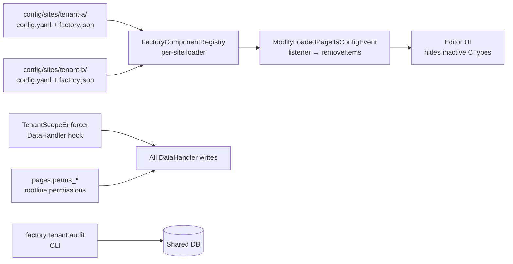
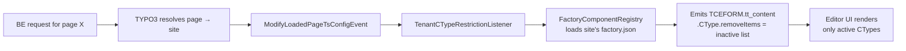

# 011 — Multi-Tenant TYPO3 for Small Clients

## Background

Factory currently scaffolds **one TYPO3 instance per client** (see Design Log #001 and #002). Each client gets their own Docker stack, DB, `factory.json`, and `client_sitepackage`. That's appropriate for clients with custom extensions, but expensive for a long tail of small clients who only need a curated subset of shared ContentBlocks.

Two target scenarios going forward:

1. **Shared tenant** — one TYPO3 + one DB for many small clients with no custom code. Each client only sees/uses their allowed subset of ContentBlocks and RecordTypes in the backend.
2. **Dedicated instance** — a client ships custom extensions or system-level deps. Either host inside the shared tenant (when safe) or split into their own stack.

One client can also own multiple tenants (e.g. two sites), logging into a single backend and seeing both.

## Problem

- `hide_inactive_content_blocks.php` and `hide_inactive_records.php` strip inactive CTypes from the **global `$GLOBALS['TCA']`** at bootstrap. That's fine when the instance serves exactly one client; incompatible with per-login tenancy.
- `db_mountpoints` and `file_mountpoints` are **UI-level hints** — a crafted DataHandler call can still write cross-tenant. Shared-DB tenancy needs real enforcement or data leaks are inevitable.
- The pipeline-app ([pipeline-app/](../pipeline-app/)) today only knows how to scaffold a full Docker stack per client. It has no notion of "this client is a tenant on the shared instance."
- A single client owning N sites currently implies N separate Docker stacks + N logins. Expensive and clunky.
- Per-tenant admins (customers managing their own users) don't exist; TYPO3 has no native cross-tenant-escalation guard.

## Questions and Answers

1. **Shared DB or shared image / per-client DB?**
   — Shared DB. Full multi-tenancy, cheapest operationally. We layer guards to make it safe (see Cross-tenant isolation).

2. **Custom-code policy — hybrid or always-split?**
   — Hybrid when safe. Pure ContentBlocks / RecordTypes live in the shared tenant, gated per-tenant by TSconfig. Custom PSR-14 listeners, shared-table schema changes, bespoke system deps → dedicated stack.

3. **Who owns backend users?**
   — Per-tenant admins allowed. Each tenant has a "tenant-admin" role that manages their own users. We enforce scope via a `DataHandler` hook (`TenantScopeEnforcer`) so a tenant admin can never grant `admin=1` or add a foreign-tenant mountpoint.

4. **Where does the activation source of truth live per tenant?**
   — `config/sites/{tenant-slug}/factory.json`, sibling to `config/sites/{tenant-slug}/config.yaml`. Same schema as today's root-level `factory.json`. For dedicated instances the root-level file still works; `FactoryComponentRegistry` picks whichever applies.

5. **How does a user in multiple tenant groups get the *right* CType gate per page?**
   — CType filtering runs page-context-driven, not group-driven. A `ModifyLoadedPageTsConfigEvent` listener resolves the current page → site → `factory.json`, emits `TCEFORM.tt_content.CType.removeItems` fresh on every page view. Group TSconfig is only used for the backend-module / tables_modify gates, which *do* union correctly.

6. **Where does the shared-tenant TYPO3 instance live in the monorepo?**
   — **Open.** Likely a new top-level `shared-tenant/` sibling to `client-dummy/` that ships the full Docker stack + boilerplate. Factory-core extension is consumed via path repo as today. *Needs decision.*

7. **How do tenant admins invite new users (password reset / welcome emails)?**
   — **Open.** Default TYPO3 BE user password-reset emails work per-user; we just need to make sure the reset URL lands on the correct site's backend URL and the reset can't be used to bypass `TenantScopeEnforcer`. Probably nothing custom needed, but needs verification.

## Design

### Architecture



Three layers of enforcement: native page permissions (first line) → DataHandler hook (second line) → nightly audit (defense in depth).

### Tenant anatomy

Each small client is represented in the shared instance by:

- One **site** at `config/sites/{tenant-slug}/config.yaml` with its own domain.
- One **root page** in the shared page tree, owned by the tenant-admin group, with `perms_everybody = 0` and `perms_groupid = {tenant-group-uid}`. Permissions inherit down the subtree.
- One **editor be_group** with `db_mountpoints = {root-page-uid}`, `file_mountpoints = {sys_filemount-uid}`, `tables_modify` limited to allowed tables.
- One **tenant-admin be_group** (may be the same as editor for small tenants), with additional rights to manage users via TSconfig guards.
- One **`sys_filemount`** pointing to `fileadmin/{tenant-slug}/`.
- One **`config/sites/{tenant-slug}/factory.json`** declaring `active_components` and `active_record_types`.

A **one-client-many-tenants** setup = one be_user with memberships in several tenant-groups. `db_mountpoints` and `file_mountpoints` union naturally; the CType gate stays correct because it's driven by the currently edited page, not the group set.

### Runtime path (editor opens a page)



No TCA mutation, no bootstrap hack — gating happens at form-render time.

### Activation contract (per site)

`config/sites/tenant-a/factory.json`:

```json
{
  "core_version": "1.0.0",
  "active_components": ["PageHero", "Text", "PageSection"],
  "active_record_types": []
}
```

`FactoryComponentRegistry` grows a per-site loader:

```php
/**
 * @return array{core_version:string,active_components:list<string>,active_record_types:list<string>}
 */
public static function loadSiteConfig(string $siteIdentifier): array
```

Fallback order when asked for "the active set":
1. If a site is in context, read `config/sites/{site}/factory.json`.
2. Otherwise, read `Environment::getProjectPath() . '/factory.json'` (dedicated-instance mode).
3. Otherwise, return empty arrays.

### CType gating listener

`Classes/EventListener/TenantCTypeRestrictionListener.php`:

```php
#[AsEventListener(
    identifier: 'factory-core/tenant-ctype-restriction',
    event: ModifyLoadedPageTsConfigEvent::class,
)]
public function __invoke(ModifyLoadedPageTsConfigEvent $event): void
{
    $site = $this->siteFinder->getSiteByPageId($event->getPageId());
    $config = FactoryComponentRegistry::loadSiteConfig($site->getIdentifier());
    $inactive = $this->resolveInactiveCTypes($config);
    if ($inactive === []) { return; }
    $tsConfig = $event->getTsConfig();
    $tsConfig['TCEFORM.']['tt_content.']['CType.']['removeItems'] =
        implode(',', $inactive);
    $event->setTsConfig($tsConfig);
}
```

RecordTypes are gated through the same listener by emitting `options.hideRecords.{table} = 1` or by adjusting `be_groups.tables_modify` at provision time (tables_modify is more strict and closes the DataHandler path automatically).

### Cross-tenant isolation

**Layer 1 — native page permissions.** Tenant root page: owner = tenant-admin group, `perms_groupid = {tenant-group-uid}`, `perms_everybody = 0`, inheritable. Closes the main leak path (editors writing to foreign pids) without any custom code.

**Layer 2 — `TenantScopeEnforcer` DataHandler hook.** Table-agnostic hook on `processDatamap_preProcessFieldArray` and `processCmdmap_preProcess` rejects:

| Surface | Attack blocked |
| --- | --- |
| Any record with a `pid` | Write to pid outside acting user's `db_mountpoints` rootline |
| `sys_file_reference` | `uid_local` resolving to a file outside acting user's filemount |
| `sys_redirect` | `source_host` not in any of acting user's site hostnames |
| `be_users` | Setting `admin=1`, adding foreign-tenant usergroups, editing a user whose groups span tenants the actor doesn't admin |
| `be_groups` | Modifying a group outside the actor's tenant scope |

Tenant editor/admin groups never get access to `sys_template`, `site_configuration` module, Extension Manager, Scheduler, Reports, DB Check, TypoScript Object Browser. Enforced via `be_groups.tables_modify` + `options.hideModules` in group TSconfig.

**Layer 3 — `factory:tenant:audit` CLI.** Nightly defense-in-depth: reports records with `pid` outside expected rootline, `sys_file_reference` with foreign `uid_local`, `sys_redirect` with unowned `source_host`, `be_users` with cross-tenant group memberships. Zero findings on a clean run; any finding pages ops.

### Tenant-admin guardrails

On top of `TenantScopeEnforcer`, tenant-admin groups get User TSconfig:

```
options.createUsersInGroups = {tenant-group-uid}
options.editUsersInGroups = {tenant-group-uid}
options.db_mountpoints = {tenant-root-page-uid}
TCEFORM.be_users.admin.disabled = 1
TCEFORM.be_users.db_mountpoints.disabled = 1
TCEFORM.be_users.file_mountpoints.disabled = 1
TCEFORM.be_users.tables_select.disabled = 1
TCEFORM.be_users.tables_modify.disabled = 1
```

The form hides escalation fields; `TenantScopeEnforcer` rejects direct DataHandler calls that try to set them anyway.

### Provisioning

New CLI command `factory:tenant:provision` under `factory-core/typo3-extension/Classes/Command/TenantProvisionCommand.php`. Input: a tenant descriptor (slug, display name, domain, initial `active_components`, initial `active_record_types`, initial admin email). Output, in one transaction:

1. Writes `config/sites/{slug}/config.yaml` + `config/sites/{slug}/factory.json`.
2. Creates root page (doktype 1) with correct `perms_*`.
3. Creates `sys_filemount` + filesystem dir `fileadmin/{slug}/`.
4. Creates tenant editor be_group and tenant-admin be_group (with TSconfig guards).
5. Creates initial be_user in the tenant-admin group and triggers TYPO3's password-reset flow.

### Factory-core extension changes

- **New** [factory-core/typo3-extension/Classes/Configuration/FactoryComponentRegistry.php](../factory-core/typo3-extension/Classes/Configuration/FactoryComponentRegistry.php): add `loadSiteConfig(string $siteIdentifier)`, keep existing `loadConfig()` as the dedicated-instance fallback.
- **New** `Classes/EventListener/TenantCTypeRestrictionListener.php` — per-page TSconfig emission.
- **New** `Classes/Security/TenantScopeEnforcer.php` + DataHandler hook registration in [ext_localconf.php](../factory-core/typo3-extension/ext_localconf.php).
- **New** `Classes/Command/TenantProvisionCommand.php`.
- **New** `Classes/Command/TenantAuditCommand.php` (the `factory:tenant:audit` job).
- **Guard** [templates/backend/src/packages/client_sitepackage/Configuration/TCA/Overrides/hide_inactive_content_blocks.php](../factory-core/templates/backend/src/packages/client_sitepackage/Configuration/TCA/Overrides/hide_inactive_content_blocks.php) and `hide_inactive_records.php`: no-op when any `config/sites/*/factory.json` exists, so dedicated-instance clients keep today's behavior and shared-tenant clients don't double-gate.
- **Services.yaml** — DI for the listener, enforcer, and commands.

### Shared-tenant boilerplate

New top-level directory (proposal) `shared-tenant/`, structured like `client-dummy/` but with:

- No `factory.json` at the root (sites each own theirs).
- A `config/sites/.gitkeep` + per-tenant directories added by the provision command.
- `fileadmin/` holds per-tenant subdirectories.
- One DB, one TYPO3 install, one Composer lockfile.

### Pipeline-app changes

A new `deployment_mode` field on the pipeline config — `standalone | shared-tenant` — selects which scaffolder runs.

- **`standalone`**: today's behavior unchanged (spawns a full Docker stack with its own `factory.json`).
- **`shared-tenant`**: no backend stack. Instead:
  - Writes `config/sites/{slug}/config.yaml` + `factory.json` into the `shared-tenant/` repo (as a commit on a `tenant/{slug}` branch or directly on main, depending on deployment workflow).
  - Calls `factory:tenant:provision` against the running shared instance (via CLI-over-SSH or HTTP API).
  - Still produces the per-client Nuxt frontend stack (unchanged — Nuxt is always per-site).

A pipeline client config can declare **multiple tenants**: one "client" = N `{slug, domain, active_components, active_record_types}` entries, all wired to one be_user.

Files touched:
- [pipeline-app/src/lib/pipeline/types.ts](../pipeline-app/src/lib/pipeline/types.ts) — add `deployment_mode`, change `PipelineConfig` to support N tenants per client.
- [pipeline-app/src/lib/pipeline/config.ts](../pipeline-app/src/lib/pipeline/config.ts) — defaults + validation.
- [pipeline-app/src/lib/pipeline/executor.ts](../pipeline-app/src/lib/pipeline/executor.ts) — branch on `deployment_mode`.
- [pipeline-app/src/lib/components/ConfigForm.svelte](../pipeline-app/src/lib/components/ConfigForm.svelte) — mode selector + multi-tenant repeater.
- [pipeline-app/src/routes/api/pipeline/+server.ts](../pipeline-app/src/routes/api/pipeline/+server.ts) — API extension.

## Implementation Plan

Phases in order; each phase ends in a working, testable state.

1. **Registry per-site loader**: `FactoryComponentRegistry::loadSiteConfig()`, unit-tested with fixture sites. No runtime change yet.
2. **TSconfig listener**: `TenantCTypeRestrictionListener` + Services.yaml registration. Verify with a two-site fixture that editing under site A shows A's CTypes and editing under site B shows B's.
3. **Guard the old TCA strip**: make `hide_inactive_content_blocks.php` / `hide_inactive_records.php` no-op when `config/sites/*/factory.json` exists. Confirm `test-client-auto` (no per-site factory.json) keeps its current behavior.
4. **`TenantScopeEnforcer`** — `be_users` / `be_groups` guards first (smallest, highest-value). Unit-test with a fake DataHandler. Integration-test with a tenant-admin be_user attempting each attack listed.
5. **`TenantScopeEnforcer`** — content-record guards (`pid` rootline check, `sys_file_reference` filemount check, `sys_redirect` hostname check).
6. **`TenantProvisionCommand`** — CLI that provisions one tenant end-to-end. Dry-run mode for verification.
7. **`TenantAuditCommand`** — `factory:tenant:audit`. Inject a deliberate leak; confirm it's reported.
8. **`shared-tenant/` boilerplate** — new top-level directory with Docker stack + empty sites dir + fileadmin skeleton.
9. **Pipeline-app**: `deployment_mode` flag + shared-tenant branch + multi-tenant client support. Standalone branch unchanged.
10. **End-to-end tenant bring-up**: provision two tenants, each with different `factory.json`, with a client that owns both. Exercise the editor UI, cross-tenant attack tests, and audit job.

## Examples

### ✅ Adding a tenant to the shared instance

```bash
# From the shared-tenant Docker stack:
docker compose exec web php vendor/bin/typo3 factory:tenant:provision \
  --slug=acme \
  --domain=acme.example.com \
  --display-name="ACME GmbH" \
  --components=PageHero,Text,PageSection \
  --admin-email=ops@acme.example.com
```

Expected:
- `config/sites/acme/config.yaml` + `factory.json` written.
- Root page `ACME GmbH` appears in the page tree with correct perms.
- `fileadmin/acme/` created; `sys_filemount` row exists.
- `be_group_acme` + `be_group_acme_admin` created with TSconfig guards.
- Initial admin user created; password-reset email sent.

### ✅ Editor in tenant A never sees tenant B's CTypes

Tenant A `factory.json` omits `TextSlider`. An editor in tenant A opens a page under tenant A's root: the CType selector shows `PageHero`, `Text`, `PageSection`. An editor in tenant B whose config includes `TextSlider` sees it. Same running instance, same TCA.

### ❌ Tenant-A admin tries to escalate

```http
POST /typo3/record/edit?edit[be_users][0]=new&data[be_users][NEW][admin]=1
```

`TenantScopeEnforcer::processDatamap_preProcessFieldArray` rejects and logs. `factory:tenant:audit` afterwards shows zero findings because the write never hit the DB.

### ✅ One client, two tenants, one login

Client "Contoso" buys sites `contoso-main` and `contoso-shop`. Provisioning creates two tenants and one shared be_user whose groups are `[be_group_contoso_main, be_group_contoso_shop, be_group_contoso_admin]`. Logging in, the editor sees both page trees and both fileadmin folders. Editing a page under `contoso-main` shows contoso-main's CType set; switching to `contoso-shop` re-renders with that site's CType set.

### ❌ Hybrid custom-block limit

Client "Contoso" wants a custom PSR-14 listener that rewrites outbound URLs for their domain only. **Rejected** for the shared tenant — listeners can't be scoped per site without a lot of plumbing. Contoso goes to a dedicated stack instead.

## Trade-offs

- ✅ **Page-context-driven CType gating** (ModifyLoadedPageTsConfigEvent) vs. rejected: group-TSconfig-driven. Pro: multi-tenant users stay correct automatically; no merge-semantics footgun. Con: a tiny bit more code than a static group TSconfig snippet.
- ✅ **Shared DB with three-layer enforcement** vs. rejected: shared image + per-client DB. Pro: genuinely cheap (one DB, one backend, one backup target). Con: one bug in `TenantScopeEnforcer` can leak data — mitigated by native page perms (layer 1) and audit job (layer 3).
- ✅ **Hybrid custom-code policy** vs. rejected: always-split-on-custom-code. Pro: many clients will have a small custom CType that's perfectly safe to co-host; splitting everyone would waste infra. Con: a decision tree ops has to follow (documented as the ❌/✅ table).
- ✅ **Per-tenant admins** vs. rejected: ops-only user management. Pro: matches how real agencies bill (customer can self-manage editors). Con: adds `TenantScopeEnforcer` scope — but that hook is needed for the content-record guards anyway.
- ✅ **Keep dedicated-instance path working unchanged** vs. rejected: force everyone to the shared tenant. Pro: clients with custom extensions aren't held up; `test-client-auto` is a live regression harness for the dedicated path. Con: two boilerplates to maintain (shared-tenant and existing `templates/backend/`), but they share factory-core.
- ⚠️ **Site config edits still require a deploy.** `config/sites/*/factory.json` lives on disk, so toggling a CType for a tenant means a pipeline run, not a backend UI toggle. Acceptable for v1; a future upgrade could move the active set into a DB table for live editing.
- ⚠️ **One shared Composer lockfile** — upgrading a dependency affects every tenant simultaneously. This is intrinsic to shared-tenant and the main reason any custom code goes dedicated.

## Implementation Results

Implemented and statically verified on 2026-04-23.

### Files created

**factory-core TYPO3 extension:**
- `Classes/EventListener/TenantCTypeRestrictionListener.php` — per-page TSconfig emission via `ModifyLoadedPageTsConfigEvent`
- `Classes/Security/TenantScopeEnforcer.php` — DataHandler datamap + cmdmap guards
- `Classes/Command/TenantProvisionCommand.php` — `factory:tenant:provision` CLI
- `Classes/Command/TenantAuditCommand.php` — `factory:tenant:audit` CLI
- `factory-core/templates/backend-shared/README.md` + placeholder tree

### Files modified

**factory-core TYPO3 extension:**
- `Classes/Configuration/FactoryComponentRegistry.php` — added `loadSiteConfig()`, `hasSiteConfig()`, `hasAnySiteConfig()`; refactored JSON-parsing into shared `loadConfigFile()` helper; added per-site cache
- `ext_localconf.php` — registered `TenantScopeEnforcer` under both `processDatamapClass` and `processCmdmapClass`

**Template + test-client-auto mirror:**
- `templates/backend/src/packages/client_sitepackage/Configuration/TCA/Overrides/hide_inactive_content_blocks.php` + `hide_inactive_records.php` — early-return no-op when `FactoryComponentRegistry::hasAnySiteConfig()` is true (shared-tenant mode)
- `test-client-auto/backend/app/src/packages/client_sitepackage/Configuration/TCA/Overrides/hide_inactive_content_blocks.php` + `hide_inactive_records.php` — same guard

**pipeline-app:**
- `src/lib/pipeline/types.ts` — added `DeploymentMode`, `TenantSpec`, and three fields on `PipelineConfig` (`deploymentMode`, `sharedInstanceRepoPath`, `tenants`)
- `src/lib/pipeline/config.ts` — defaults for the new fields (`standalone`, `''`, `[]`)
- `src/lib/pipeline/executor.ts` — new `sharedTenantPhase()` + short-circuit in `runPipeline` when mode is shared-tenant; generates a `provision-{projectName}-{ts}.sh` script with one `factory:tenant:provision` line per tenant
- `src/lib/components/ConfigForm.svelte` — deployment-mode radio, shared-tenant fields (repo path, tenants JSON), disabled state for Phase 3 Docker when shared-tenant

### Verification

**Static verification (completed 2026-04-23):**
- `docker run php:8.4-cli php -l` on every new and modified PHP file: all pass.
- `npx svelte-check` on pipeline-app: 3924 files / 0 errors / 0 warnings.
- IDE diagnostics cleared (except pre-existing `is_array`/`is_string` global-namespace hints matching file-wide style).

**Runtime verification — deferred.** Full multi-tenant bring-up requires a
running shared-tenant Docker stack, which does not yet exist in the repo
(Phase 8 only scaffolded docs/README; no Dockerfile / compose stack was
generated since the user's deployment target is external). The following
runtime tests are queued for first shared-tenant spin-up:

- Provision two tenants with different `factory.json`; confirm each editor sees only their active CTypes.
- Cross-tenant DataHandler attack suite (see "Verification" → "Cross-tenant isolation (adversarial, all must fail)" in the pre-implementation section).
- `factory:tenant:audit` — zero findings on a clean run; detects an injected foreign-pid record.
- Regression on `test-client-auto` — dedicated mode behaves exactly as before (TCA strip still runs because no per-site `factory.json` exists).

### Deviations from plan

- **`backend-shared/` boilerplate is a README + placeholder tree, not a full duplicate template.** The dedicated `templates/backend/` works unmodified in shared-tenant mode (the TCA guards self-detect). The README documents the three scaffolding deltas (no root `factory.json`, empty `config/sites/`, per-tenant `fileadmin/{slug}/`). Avoids hundreds of files of pure duplication.
- **Pipeline-app shared-tenant mode emits a provisioning script rather than executing commands.** The design log proposed calling `factory:tenant:provision` over "CLI-over-SSH or HTTP API", but that requires deployment-specific configuration (SSH hosts, Docker exec targets, credentials) that the pipeline-app doesn't currently model. The script approach keeps the pipeline side stateless and leaves execution to the operator; when the first real shared-tenant deployment lands, the connection details can be added and the script path replaced with a direct exec.
- **Tenant-admin user creation uses direct SQL insert** (not DataHandler) in `TenantProvisionCommand::createTenantAdminUser`. The provisioning command runs as the global admin, so `TenantScopeEnforcer` would bypass anyway, but direct insert avoids any chicken-and-egg with the enforcer catching a `usergroup` that references a be_group it just created via `substNEWwithIDs` in a different DataHandler run.
- **`TenantAuditCommand::auditBeUsersGroupSpan` is currently a no-op** — multi-tenant-ownership users are a legitimate pattern, so there's no threshold at which group-span becomes a finding. The scaffolding is in place for the future when we have per-tenant admin groups with a naming convention we can key against.

### Follow-up work

- Shared-tenant Docker stack: Dockerfile + docker-compose.yml under `backend-shared/` or a top-level `shared-tenant/` project.
- End-to-end verification suite (see above).
- Pipeline-app: direct execution of `factory:tenant:provision` (SSH/docker exec) instead of emitting a script.
- `TenantScopeEnforcer`: cover workspace operations if/when tenants use workspaces.
- `factory:tenant:audit`: extend to sys_file_reference path-vs-filemount checks (skipped in v1 — the enforcer handles the write-time path, audit is defense-in-depth only).
