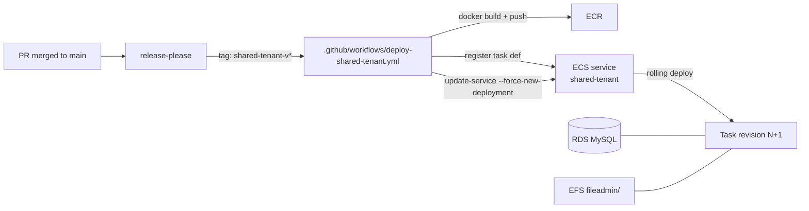
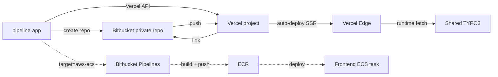

# 012 — Hosting & Package Publishing

## Background

Design Log #011 landed the code for shared-tenant TYPO3 and tenant-scope enforcement, but the Factory monorepo still has no production hosting story and no package releases. Every client today consumes `factory-core` via path repos + symlinks — that scales to our own test fixtures but not to real clients on real domains.

Two decisions block real client onboarding:

1. **Where do the shared-tenant TYPO3 and per-client Nuxt frontends run?**
2. **How does `factory-core` get released so client projects can `composer require` / `npm install` it?**

## Problem

- **No production deployment** for the shared-tenant backend. The existing Dockerfile is local-dev oriented (mounts, MySQL-in-container, no healthcheck for a cloud LB). `factory:tenant:provision` exists but runs nowhere outside a developer's laptop.
- **No CI/CD** anywhere in the repo. `pipeline-app/` is a local scaffolding UI; it writes code but doesn't deploy it. No `.github/workflows/`, no Bitbucket Pipelines for anything that matters.
- **No per-client frontend hosting** plan. Today's frontend scaffolding assumes the client's dev stack + Docker stays the runtime.
- **`factory-core/nuxt-layer` is not publishable** as-is: `package.json` has no `exports`, `files`, or `.npmignore`; publishing today would ship `node_modules/` and misroute the layer entry. License is source-available, not valid on public npm without thought.
- **`factory-core/typo3-extension` is publishable but not published.** `composer.json` name + license are correct, but `ext_emconf.php` says `state: alpha`; version lives in three places; no Packagist registration; no release automation.
- **Three separate version sources** (`nuxt-layer/package.json`, `typo3-extension/composer.json`, `typo3-extension/ext_emconf.php`) drift silently today — no script to keep them aligned.
- **No release cadence**. No CHANGELOG, no tags, no GitHub Releases.

## Questions and Answers

1. **Backend hosting target?** — The existing LABOR.digital AWS cluster running **ECS on EC2**. Treat as a black box; ship an image to ECR and update the service. Don't redesign AWS.

2. **Frontend hosting target?** — **Vercel as the default** (native Bitbucket integration, SSR via Nitro `vercel` preset, zero ops). Opt-in AWS ECS path for custom/compliance clients. Client frontend repos live in **Bitbucket private repos**.

3. **Rendering mode?** — **Keep SSR.** Every TYPO3 edit must be live immediately. No SSG/hybrid complexity.

4. **Package visibility — public or private?** — **Public** on `npmjs.org` + `packagist.org`. Adopt MIT for the Nuxt layer (relicense from source-available). TYPO3 extension stays GPL-2.0-or-later (required by TYPO3 copyleft).

5. **Release cadence?** — **release-please** on GitHub Actions, driven by Conventional Commits. `factory-core` monorepo already lives on GitHub.

6. **Version coordination?** — release-please bumps the two package versions + `ext_emconf.php`. `manifest.json` per-component versions stay independent (they track component-level API changes, not package releases).

## Design

### A. Hosting

#### Backend — shared-tenant TYPO3 on ECS-on-EC2



**Deliverables:**

- `shared-tenant/backend/app/Dockerfile.production` — multi-stage build. `composer install --no-dev --optimize-autoloader`, pre-warm TYPO3 cache, non-root runtime user, `/healthz` endpoint for the ALB target group.
- `shared-tenant/backend/app/ecs-task-definition.json` — `${IMAGE}` placeholder replaced at deploy time; env vars pulled from Secrets Manager (DB creds, encryption key, install-tool password, SMTP); EFS volume mount for `fileadmin/`.
- `shared-tenant/backend/app/.env.production.template` — documents every env var the task def expects.
- `.github/workflows/deploy-shared-tenant.yml` — OIDC role assumption, build + push to ECR, `aws ecs register-task-definition`, `aws ecs update-service --force-new-deployment`, `aws ecs wait services-stable` (fail job on rollout timeout).

**Persistent state:** MySQL → existing RDS; `fileadmin/` → EFS mount.

#### Frontends — Vercel default, AWS opt-in



**Deliverables:**

- `factory-core/templates/frontend/vercel.json` — framework preset, env vars (`NUXT_PUBLIC_TYPO3_API_BASE_URL`, etc.), SSR region config.
- [factory-core/templates/frontend/nuxt.config.ts](factory-core/templates/frontend/nuxt.config.ts) — `nitro.preset` driven by env. `NITRO_PRESET=vercel` (default), `node-server` for the AWS path.
- [pipeline-app/src/lib/pipeline/types.ts](pipeline-app/src/lib/pipeline/types.ts) — add `frontendHostingTarget: 'vercel' | 'aws-ecs'` (default `'vercel'`), `vercelToken`, `vercelTeamId`.
- [pipeline-app/src/lib/pipeline/executor.ts](pipeline-app/src/lib/pipeline/executor.ts) — after Bitbucket repo creation, if target=vercel, call the Vercel API to create the project + link the repo + set env vars.
- `.github/workflows/deploy-frontend-on-aws.yml` — reference workflow, shipped as a template under `factory-core/templates/frontend/` for clients who opt into the AWS path.

### B. Package publishing

#### Nuxt layer → public npm (`@labor-digital/factory-nuxt-layer`)

Clean up [factory-core/nuxt-layer/package.json](factory-core/nuxt-layer/package.json):

```jsonc
{
  "name": "@labor-digital/factory-nuxt-layer",
  "version": "1.0.0",
  "license": "MIT",
  "exports": {
    ".": "./nuxt.config.ts",
    "./components/*": "./components/*",
    "./composables/*": "./composables/*",
    "./lib/*": "./lib/*"
  },
  "files": [
    "components", "composables", "layouts", "lib",
    "plugins", "utils", "nuxt.config.ts", "README.md"
  ],
  "peerDependencies": { "@nuxt/ui": "^4" }
}
```

Plus a `.npmignore` as belt-and-braces (excludes `node_modules/`, `.nuxt/`, tests, playground).

**No build step** — Nuxt layers ship raw `.ts`/`.vue`, the consumer's Vite pipeline transpiles. This matches the Nuxt upstream layer-publishing convention.

#### TYPO3 extension → public Packagist (`labor-digital/factory-core`)

- [factory-core/typo3-extension/composer.json](factory-core/typo3-extension/composer.json) — add `"version": "1.0.0"`, expand `description`, add `keywords: ["typo3", "headless", "content-blocks", "factory"]`.
- `factory-core/typo3-extension/ext_emconf.php` — `state: alpha` → `state: stable`.
- One-time: register the GitHub repo on Packagist via their UI, install their auto-sync webhook.

TER (TYPO3 Extension Repository) is optional — defers to a later iteration.

#### release-please config

Monorepo mode, two packages tracked:

```jsonc
// release-please-config.json
{
  "packages": {
    "factory-core/nuxt-layer": {
      "release-type": "node",
      "package-name": "@labor-digital/factory-nuxt-layer"
    },
    "factory-core/typo3-extension": {
      "release-type": "php",
      "package-name": "labor-digital/factory-core",
      "extra-files": ["ext_emconf.php"]
    }
  }
}
```

`extra-files` lets release-please sed-bump the version string embedded in `ext_emconf.php` alongside `composer.json`. `.release-please-manifest.json` tracks the current version of each package.

#### GitHub Actions workflows

- `.github/workflows/release-please.yml` — on `main` push: opens/updates the Release PR.
- `.github/workflows/release-nuxt-layer.yml` — on tag `factory-nuxt-layer-v*`: `npm publish --access public --provenance` using `NPM_TOKEN` secret.
- `.github/workflows/release-typo3-extension.yml` — on tag `factory-core-v*`: composer validate + optional Slack notify. Packagist auto-syncs via webhook.
- `.github/workflows/pr-checks.yml` — PR-time lint + typecheck (`svelte-check`, `tsc`, PHP CS) to prevent releasing broken code.

#### Consumer migration

When a client project moves from path-repo → published packages:

- `composer.json`: drop `"type": "path"` entry; change `"labor-digital/factory-core": "@dev"` → `"^1.0"`. Remove the `factory-core` symlink under `backend/app/`.
- `nuxt.config.ts`: `extends: ['../modules/nuxt-layer']` → `extends: ['@labor-digital/factory-nuxt-layer']`.
- pipeline-app: new `factoryCoreSource: 'local' | 'npm'` config field. Default `local` (for monorepo development); scaffolded client repos get `npm`.

### Repo layout (after both parts ship)

```
Factory/
├── .design-log/
│   └── 012-hosting-and-packaging.md
├── .github/
│   └── workflows/
│       ├── release-please.yml
│       ├── release-nuxt-layer.yml
│       ├── release-typo3-extension.yml
│       ├── pr-checks.yml
│       └── deploy-shared-tenant.yml
├── release-please-config.json
├── .release-please-manifest.json
├── factory-core/
│   ├── nuxt-layer/
│   │   ├── package.json    ← exports, files, MIT
│   │   └── .npmignore
│   ├── typo3-extension/
│   │   ├── composer.json   ← version, keywords, description
│   │   └── ext_emconf.php  ← state: stable
│   └── templates/frontend/
│       ├── vercel.json
│       └── nuxt.config.ts  ← Nitro preset via env
└── shared-tenant/
    └── backend/app/
        ├── Dockerfile.production
        ├── ecs-task-definition.json
        └── .env.production.template
```

## Implementation Plan

Split into **Part B first** (packaging — smaller, self-contained, unblocks the AWS workflow's eventual consumption of the published extension), then **Part A** (hosting).

### Part B — Package publishing

B1. **Relicense Nuxt layer** — update root [LICENSE](LICENSE) + [LICENSES.md](LICENSES.md) + [factory-core/nuxt-layer/package.json](factory-core/nuxt-layer/package.json) `license` field. MIT.

B2. **Nuxt layer `package.json` cleanup** — add `exports`, `files`, `.npmignore`. Verify `npm pack --dry-run` lists only the intended files.

B3. **TYPO3 extension cleanup** — bump `state` to `stable`, add explicit `version` + `keywords` + richer `description`.

B4. **release-please config** — `release-please-config.json` + `.release-please-manifest.json` seeded with `1.0.0` for both packages.

B5. **GitHub Actions workflows** — release-please, release-nuxt-layer, release-typo3-extension, pr-checks.

B6. **pipeline-app `factoryCoreSource`** — add to types + config + executor + ConfigForm. Default `local` for internal dev, `npm` for scaffolded client repos. Executor scaffoldPhase branches: local → symlinks (today's behavior); npm → `composer require labor-digital/factory-core` + `npm install @labor-digital/factory-nuxt-layer`.

B7. **Typecheck** — `svelte-check` on pipeline-app, `composer validate` on typo3-extension, `npm pack --dry-run` on nuxt-layer.

### Part A — Hosting

A1. **Dockerfile.production** — multi-stage, non-root, healthz endpoint. Verify with `docker build`.

A2. **ECS task definition** — JSON file with `${IMAGE}` placeholder, Secrets Manager refs, EFS mount.

A3. **`.env.production.template`** — document every env var.

A4. **deploy-shared-tenant.yml** — OIDC, build/push, register/update, wait-stable.

A5. **Operator runbook** — append to [shared-tenant/README.md](shared-tenant/README.md): first-time ECR setup, EFS provisioning, Secrets Manager entries, OIDC trust policy.

A6. **Vercel frontend template** — `vercel.json` + `nuxt.config.ts` Nitro preset env wiring.

A7. **Pipeline-app Vercel integration** — `frontendHostingTarget` + Vercel API calls in executor.

A8. **AWS frontend reference workflow** — `deploy-frontend-on-aws.yml` as a template file.

## Examples

### ✅ Landing a component change

```
git checkout -b feat/hero-ctas
# edit factory-core/nuxt-layer/components/T3/Content/PageHero.vue
git commit -m "feat(page-hero): add primary + secondary CTA slots"
git push && open PR → merge
```

Within a few minutes:
- release-please opens a "Release PR" bumping `@labor-digital/factory-nuxt-layer` from `1.0.0` → `1.1.0`, writing a CHANGELOG entry from the commit.

Merge the Release PR:
- Tag `factory-nuxt-layer-v1.1.0` pushes.
- `release-nuxt-layer.yml` publishes to npm.
- Existing client projects run `npm update @labor-digital/factory-nuxt-layer` and pick up the new CTA slots.

### ✅ Scaffolding a fresh client that consumes published packages

```
pipeline-app:
  deploymentMode: standalone
  factoryCoreSource: npm         ← new default for real clients
  testProjectName: acme
  componentsToTest: [PageHero, Text, PageSection]
```

Executor scaffoldPhase:
- `composer init` + `composer require labor-digital/factory-core:^1`
- `npm init` + `npm install @labor-digital/factory-nuxt-layer`
- `nuxt.config.ts` generated with `extends: ['@labor-digital/factory-nuxt-layer']`

No symlinks. Client's repo pushed to Bitbucket. Vercel picks up, deploys.

### ❌ Don't stage path-repo changes as if they're releases

Editing `factory-core/nuxt-layer/components/…` and expecting clients who installed via npm to see it is a category error — they won't until the next release-please → tag → publish cycle. This is the intended trade-off.

### ✅ Shared-tenant backend deploy

```
# Someone merges a PHP fix to TenantScopeEnforcer on main
# .github/workflows/deploy-shared-tenant.yml triggers:
- OIDC-assume the deploy role
- docker build -f shared-tenant/backend/app/Dockerfile.production
- docker push $ECR/factory-shared-tenant:$GITHUB_SHA
- aws ecs register-task-definition (new revision with updated image tag)
- aws ecs update-service --force-new-deployment
- aws ecs wait services-stable  (5-min timeout, fails job if exceeded)
```

Rolling deploy; active tenants keep serving during rollover.

## Trade-offs

- ✅ **Vercel for frontends** vs. rejected: always-AWS-ECS. Pros: minutes-to-live for small clients, native Bitbucket webhook, SSR + TLS + CDN included, per-project domain auto-wired. Cons: another vendor to trust with client source; Vercel's Pro plan needed for some features past free tier. Escape hatch: AWS ECS is a one-config-toggle away per client.
- ✅ **ECS-on-EC2** vs. rejected: Fargate / EKS. Pros: lives in the cluster you already run, no new infra to provision. Cons: YOU manage the EC2 hosts — patching, scaling, capacity. Acceptable because the team already operates the cluster.
- ✅ **Public MIT Nuxt layer + GPL TYPO3 extension** vs. rejected: private/paid Packagist + private npm. Pros: no paid infra, maximum adoption, contributors welcome. Cons: code is visible (which is already true for monorepo access today); need to be disciplined about not shipping client-specific code to `factory-core/`.
- ✅ **release-please over semantic-release / changesets** vs. rejected alternatives. Pros: monorepo-aware out of the box, opens a human-reviewable Release PR (easier than "it just tagged while you slept"), lower ceremony than changesets. Cons: less flexible for pre-releases; if we ever need that, changesets would be the migration.
- ✅ **SSR baseline** vs. rejected: hybrid ISR or SSG. Pros: editors see their changes live without revalidation lag; matches TYPO3 expectations; Nitro handles it. Cons: compute cost per request — fine at the current scale. Can revisit per-tenant if one grows into massive traffic.
- ⚠️ **`manifest.json` per-component versions stay independent** from the package version that release-please tracks. We must be disciplined: `manifest.json` tracks component-level compatibility, the npm/Composer version tracks the overall factory-core release. They'll drift; that's intended.
- ⚠️ **Source-available → MIT relicense** is a one-way decision. Once `1.0.0` ships under MIT, we cannot "unpublish" or retract the license on consumers who already installed it. Worth a final lawyer/legal-aware sign-off before first `npm publish`.
- ❌ **Do not** register TER (TYPO3 Extension Repository) in the first release. Packagist alone is enough; TER adds another registration + release step and no client actually installs TYPO3 extensions from TER anymore.

## Implementation Results — Part B (Packaging)

Implemented and statically verified on 2026-04-23.

### Files created

- [factory-core/nuxt-layer/LICENSE](factory-core/nuxt-layer/LICENSE) — MIT license text.
- [factory-core/nuxt-layer/.npmignore](factory-core/nuxt-layer/.npmignore) — belt-and-braces on top of `files` whitelist.
- [factory-core/nuxt-layer/README.md](factory-core/nuxt-layer/README.md) — minimal README for the npm page.
- [release-please-config.json](release-please-config.json), [.release-please-manifest.json](.release-please-manifest.json) — monorepo-aware config tracking both packages at `1.0.0`.
- [.github/workflows/release-please.yml](.github/workflows/release-please.yml) — opens Release PRs on every `main` push.
- [.github/workflows/release-nuxt-layer.yml](.github/workflows/release-nuxt-layer.yml) — publishes to npm on `factory-nuxt-layer-v*` tags.
- [.github/workflows/release-typo3-extension.yml](.github/workflows/release-typo3-extension.yml) — validates composer + confirms Packagist sync on `factory-core-v*` tags.
- [.github/workflows/pr-checks.yml](.github/workflows/pr-checks.yml) — PR-time `npm pack --dry-run`, `composer validate`, PHP `php -l`, and pipeline-app `svelte-check`.

### Files modified

- [factory-core/nuxt-layer/package.json](factory-core/nuxt-layer/package.json) — `license: "MIT"`, `description`, `keywords`, `exports` (primary + per-dir subpaths), `files` whitelist.
- [factory-core/typo3-extension/composer.json](factory-core/typo3-extension/composer.json) — explicit `version: "1.0.0"`, expanded `description`, `keywords`.
- [factory-core/typo3-extension/ext_emconf.php](factory-core/typo3-extension/ext_emconf.php) — `state: alpha → stable`, author updated to LABOR.digital, `x-release-please-version` annotation on the version line.
- [LICENSES.md](LICENSES.md) — documented the new MIT carve-out for `factory-core/nuxt-layer/`.
- [pipeline-app/src/lib/pipeline/types.ts](pipeline-app/src/lib/pipeline/types.ts) — added `FactoryCoreSource` type + three new `PipelineConfig` fields (`factoryCoreSource`, `factoryCoreComposerConstraint`, `factoryCoreNpmConstraint`).
- [pipeline-app/src/lib/pipeline/config.ts](pipeline-app/src/lib/pipeline/config.ts) — defaults for the new fields (`local`, `^1.0`, `^1.0.0`).
- [pipeline-app/src/lib/pipeline/executor.ts](pipeline-app/src/lib/pipeline/executor.ts) — `scaffoldPhase` branches on `factoryCoreSource`: `local` still symlinks, `npm` emits status messages noting that consumer wiring is deferred until the first published release.
- [pipeline-app/src/lib/components/ConfigForm.svelte](pipeline-app/src/lib/components/ConfigForm.svelte) — "Factory Core Source" radio group above the deployment-mode selector.

### Verification

- `docker run composer:latest composer validate` on `factory-core/typo3-extension/` → valid (one informational warning about the `version` field; that field is deliberately present for release-please and documented as expected).
- `docker run php:8.4-cli php -l ext_emconf.php` → no syntax errors.
- `cd factory-core/nuxt-layer && npm pack --dry-run` → 71-file, 30.6 kB tarball. Includes `LICENSE`, `README.md`, `components/`, `composables/`, `layouts/`, `lib/`, `plugins/`, `utils/`, `nuxt.config.ts`, `package.json`. Does **not** include `node_modules/`, `.nuxt/`, or `package-lock.json`.
- `cd pipeline-app && npx svelte-check --tsconfig ./tsconfig.json` → 3924 files / 0 errors / 0 warnings.

### Deviations from plan

- **Executor `npm` branch is a stub, not a full rewrite.** The plan called for `composer require` + `npm install` + `nuxt.config.ts` extends-swap during scaffolding when `factoryCoreSource=npm`. Shipping that today would produce broken scaffolds since the packages aren't on npm/Packagist yet. Current behavior: `npm` mode emits status messages acknowledging the selection and notes that consumer wiring lands after the first release. Once `1.0.0` is published, the stub becomes the real flow (tracked as follow-up).
- **No `--no-check-version` on the pr-checks composer validate.** The PR-check validates the full composer.json including the version field; the `--no-check-version` flag is only used on the release workflow to suppress the informational-only warning when tags are being cut.
- **Repository URL fields omitted from package.json and composer.json.** I don't know the exact GitHub URL for the `factory-core` monorepo, so I left `repository`/`homepage`/`bugs` out rather than fabricate URLs. These should be added before the first release — they show on npmjs.org / packagist.org package pages.

### Follow-up work (needed before first real release)

1. Add `repository`, `homepage`, `bugs` fields to both `package.json` and `composer.json` with the actual GitHub URL.
2. One-time: register the GitHub repo on packagist.org and install their auto-sync webhook.
3. One-time: provision `NPM_TOKEN` repo secret in GitHub (automation token with publish rights on the `@labor-digital` scope).
4. Cut the first release via a `feat: initial release` commit + merge the Release PR release-please opens.
5. After 1.0.0 is live on both registries: replace the executor's `npm`-source stub with actual `composer require` / `npm install` + `nuxt.config.ts` extends-swap. Part of the continuing pipeline-app work.
6. Then Part A (hosting): Dockerfile.production, ECS task definition, deploy-shared-tenant workflow, Vercel integration.

## Amendment 2026-04 — Fly.io over Vercel for frontends

### Why

Part A of this log specified Vercel as the default frontend hosting target. A cost-modeling pass against a realistic 30-client Labor fleet reshuffled the answer. Comparison at typical marketing-site traffic (seat costs pooled, no viral traffic):

| Platform | Monthly fleet total | Notes |
|---|---|---|
| Cloudflare Pages | €20–50 | Cheapest; Bitbucket unsupported natively |
| **Fly.io** | **€50–130** | Plain Node containers, scale-to-zero, cheap EU egress |
| Vercel + SWR | €130–200 | DL #012 + one config line |
| Vercel as-designed | €150–250 | Original Part A plan |
| Shared ECS (multi-tenant rewrite) | €90–200 | Requires Nuxt frontend rewrite |
| Render | €300–400 | Flat per-service always-on |

Fly.io wins the tradeoff between cost (3–4× cheaper than Vercel at fleet scale) and architectural fit (plain Node containers, Bitbucket works without workarounds, no bundle-size or Worker-runtime caveats). Cloudflare Pages is cheaper but its lack of native Bitbucket integration is a more invasive shape-change than switching the Nitro output preset.

### What changes in this amendment

- **Default `frontendHostingTarget: 'fly-io'`** (was `'vercel'` in the original Part A).
- **`vercel.json` and Vercel API integration in pipeline-app** — removed from plan, replaced with Fly.io equivalents. AWS ECS opt-in remains stubbed.
- **Rendering model is unchanged**: still SSR, still "live immediately" per the original Q&A #3. Fly.io SSR is already uncached, so the SWR+webhook-purge escape hatch from the Vercel cost analysis is not needed here.
- **Deploy path**: `flyctl deploy --remote-only` driven by `bitbucket-pipelines.yml` in each client repo. pipeline-app bootstraps the first deploy directly to verify the scaffold; subsequent pushes flow through Bitbucket Pipelines → Fly remote builder.

### Deliverables (shipped in this amendment)

- [factory-core/templates/frontend/fly.toml](../factory-core/templates/frontend/fly.toml) — app + region + auto-stop + VM size. `auto_stop_machines = "suspend"` for fast warm-resume.
- [factory-core/templates/frontend/Dockerfile.production](../factory-core/templates/frontend/Dockerfile.production) — multi-stage Node 22 build, runs `.output/server/index.mjs` (Nitro `node-server` preset, the Nuxt default).
- [factory-core/templates/frontend/bitbucket-pipelines.yml](../factory-core/templates/frontend/bitbucket-pipelines.yml) — `main` branch deploys via `flyctl deploy --remote-only`; uses `FLY_API_TOKEN` repo variable set by pipeline-app.
- [factory-core/templates/frontend/.env.production.template](../factory-core/templates/frontend/.env.production.template) — documents `TYPO3_API_BASE_URL` and Nitro listen config.
- [factory-core/templates/frontend/lab.boilerplate.json](../factory-core/templates/frontend/lab.boilerplate.json) — `replaceProjectNameIn` extended to include `fly.toml` and `.env.production.template`.
- [pipeline-app/src/lib/pipeline/types.ts](../pipeline-app/src/lib/pipeline/types.ts) — `FrontendHostingTarget`, `FlyIoMachineSize` types; `frontendHostingTarget`, `flyIoOrgSlug`, `flyIoRegion`, `flyIoMachineSize` on `PipelineConfig`.
- [pipeline-app/src/lib/pipeline/config.ts](../pipeline-app/src/lib/pipeline/config.ts) — defaults: `fly-io`, `labor-digital`, `ams`, `shared-cpu-1x-512`.
- [pipeline-app/src/lib/pipeline/executor.ts](../pipeline-app/src/lib/pipeline/executor.ts) — `provisionFlyIoFrontend()` helper called from `publishPhase` after push. Runs `flyctl apps create`, `flyctl secrets set --stage`, `flyctl deploy --remote-only`, enables Bitbucket Pipelines on the repo, writes `FLY_API_TOKEN` as a secured Bitbucket variable. Only runs when `publishBackend=false` (frontend-only publishes) — monorepo publishes can't host `bitbucket-pipelines.yml` at the repo root.
- [pipeline-app/src/routes/api/pipeline/+server.ts](../pipeline-app/src/routes/api/pipeline/+server.ts) — reads `FLY_API_TOKEN` from env, surfaces `flyApiTokenConfigured` on GET, passes the token to `runPipeline`.
- [pipeline-app/src/lib/components/ConfigForm.svelte](../pipeline-app/src/lib/components/ConfigForm.svelte) — "Frontend Hosting" section with radio (fly-io / aws-ecs) and conditional Fly.io inputs (org slug, region, machine size). Only shown when Phase 4 enabled + standalone mode + `publishBackend=false`.
- [pipeline-app/src/routes/+page.svelte](../pipeline-app/src/routes/+page.svelte) — `flyApiTokenConfigured` state wired through to `ConfigForm`.

### Verification

Implemented 2026-04-24.

- `cd pipeline-app && npm run check` → 3924 files / 0 errors / 0 warnings.
- Manual end-to-end test (requires `FLY_API_TOKEN` + `BITBUCKET_TOKEN` on the pipeline-app host and `flyctl` binary on PATH): run the pipeline in standalone mode with `publishBackend=false`, `frontendHostingTarget='fly-io'`, a throwaway `testProjectName` like `factory-fly-test-01`. Expected: Bitbucket repo created, Fly app `factory-fly-test-01-frontend` created, secrets staged, first `flyctl deploy --remote-only` succeeds, app returns 200 on `https://factory-fly-test-01-frontend.fly.dev`, Bitbucket Pipelines enabled + `FLY_API_TOKEN` set as secured variable.

### Deviations from the amendment plan

- **Fly app name is `{slug}-frontend`, not bare `{projectName}`.** The publish flow already suffixes `-frontend` for frontend-only Bitbucket slugs; keeping that naming for Fly apps avoids collisions if a backend-only Fly app is ever added to the same org.
- **Fly.io provisioning is gated on `publishBackend=false`.** Full-monorepo publishes put `frontend/app/` at a subdirectory, which breaks `bitbucket-pipelines.yml` location requirements and the Dockerfile build context. Added an explicit skip message for that combination instead of trying to relocate the files.
- **`flyctl secrets set` uses `--stage`.** Without staging, setting secrets on a freshly-created app triggers an immediate restart before the first machine exists, which flyctl treats as an error. Staging defers application to the first deploy, which is the operation that immediately follows.

### Scope explicitly left out

- Vercel migration path: no clients were on Vercel, so there's nothing to migrate.
- Fly.io multi-region: single-region `ams` is sufficient for Labor's EU-centric fleet.
- Preview-per-PR URLs: Fly's `flyctl deploy --branch` works, but PR-comment UX is DIY; revisit if requested.
- AWS ECS frontend reference workflow (original Part A A8): still stubbed; the radio option exists in the form but provisioning is a no-op.

## Amendment 2026-04-30 — Closing the publish loop, starting at 0.1.0

Two follow-up items from the original Part B implementation results landed today, unblocking the first cut. Decision after the Part B work was reviewed: **start at `0.1.0` (beta), not `1.0.0`**. Nothing has been published yet, and a pre-1.0 line lets us iterate on the API surface (component contracts, executor flow) without burning major versions on every breaking change. Bumping to `1.0.0` happens once a real client is in production on the published packages.

Concrete changes made for the 0.x line:

- `factory-core/nuxt-layer/package.json` `version` → `0.1.0`.
- `factory-core/typo3-extension/composer.json` `version` → `0.1.0`.
- `factory-core/typo3-extension/ext_emconf.php` `version` → `0.1.0`, `state: stable` → `state: beta`.
- `.release-please-manifest.json` — both packages seeded at `0.1.0`.
- pipeline-app defaults: `factoryCoreNpmConstraint: '^0.1.0'`, `factoryCoreComposerConstraint: '^0.1'` (npm and Composer both interpret `^0.x` as `>=0.x.0 <0.(x+1).0` — tight pinning, which is the right pre-1.0 default).
- release-please config keeps `bump-minor-pre-major: true` + `bump-patch-for-minor-pre-major: true` (already in [release-please-config.json](../release-please-config.json)). On the 0.x line this means `feat:` commits → patch bump (0.1.0 → 0.1.1), `feat!:` / breaking → minor bump (0.1.x → 0.2.0). Promoting to 1.0.0 requires a manual config flip later.

### Public-package metadata gap closed

Both packages now ship the fields the registry pages render publicly:

- [factory-core/nuxt-layer/package.json](../factory-core/nuxt-layer/package.json) — `author`, `repository` (with `directory` pointing into the monorepo subpath), `homepage`, `bugs`, `publishConfig: { access: public, provenance: true }`.
- [factory-core/typo3-extension/composer.json](../factory-core/typo3-extension/composer.json) — `authors`, `homepage`, `support.{issues,source}`.

GitHub remote is `git@github.com:labor-digital/lab-factory.git`; metadata URLs point at that repo's `main` branch.

### Pipeline-app `npm`-source mode is real

Replaced the stub at the previous executor `factoryCoreSource === 'npm'` branch with a real scaffold-patching step. After the template copy completes:

1. **Frontend `nuxt.config.ts`** — string-replaces `'../modules/nuxt-layer'` → `'@labor-digital/factory-nuxt-layer'` in the `extends` array. Throws if the literal isn't found (catches future template drift).
2. **Frontend `package.json`** — adds `@labor-digital/factory-nuxt-layer` at `config.factoryCoreNpmConstraint` (default `^0.1.0`) to `dependencies`.
3. **Backend `composer.json`** — filters the `repositories` array to drop the `path` entry pointing at `../modules/typo3-extension` (keeps the `packages/client_sitepackage` path repo); rewrites `labor-digital/factory-core: @dev` → `config.factoryCoreComposerConstraint` (default `^0.1`).

Symlink creation only runs in `local` mode; `npm` mode produces a scaffold that resolves dependencies entirely from the public registries. `composer install` / `npm install` are still operator-run (Phase 3 Docker bring-up), unchanged.

### Pre-0.1.0 release checklist

These remain to be done manually before the first publish actually succeeds:

1. **Packagist subtree split** — Packagist requires `composer.json` at the repo root, but our monorepo has it at `factory-core/typo3-extension/composer.json`. To bridge: a dedicated mirror repo whose root *is* the extension, kept in sync by [.github/workflows/split-factory-core.yml](../.github/workflows/split-factory-core.yml) using `danharrin/monorepo-split-github-action`. Operator steps:
   - Create empty repo at `https://github.com/labor-digital/factory-core` (no init, no README, no license — the split push provides everything).
   - Generate a fine-grained PAT scoped to that mirror repo with `Contents: read and write` permission. (Classic PAT with `repo` scope also works.)
   - Add the PAT as repo secret `SUBTREE_SPLIT_TOKEN` on `lab-factory`.
   - First push to `master` after the workflow lands seeds the mirror's master branch automatically.
   - Submit the **mirror** URL `https://github.com/labor-digital/factory-core` to Packagist (NOT the monorepo URL).
   - Install the Packagist GitHub webhook on the **mirror** repo (Settings → Webhooks).
2. **NPM_TOKEN** — already configured. Automation token with publish rights on the `@labor-digital` scope, set as repo secret `NPM_TOKEN`. Used by `release-nuxt-layer.yml`.
3. **GitHub Actions write permissions** — confirm "Read and write permissions" is enabled for `GITHUB_TOKEN` so release-please can open PRs (Settings → Actions → General → Workflow permissions).
4. **Cut the release** — push a `feat: initial 0.1.0 beta release of factory-core` commit to `main`. release-please opens the combined Release PR (`separate-pull-requests: false`); merge it. The two tags (`factory-nuxt-layer-v0.1.0`, `factory-core-v0.1.0`) trigger:
   - npm publish via `release-nuxt-layer.yml` (direct from monorepo subpath — no split needed for npm).
   - Mirror tag push via `split-factory-core.yml` → Packagist webhook on the mirror picks it up → composer install resolves.

### Verification

- `cd pipeline-app && npm run check` → expect 0 errors / 0 warnings.
- Local-mode regression run (existing flow untouched): symlink scaffold still produced.
- Npm-mode dry run with Phase 3 disabled: scaffolded `nuxt.config.ts` shows `'@labor-digital/factory-nuxt-layer'`; scaffolded `composer.json` has no `typo3-extension` path repo and `"labor-digital/factory-core": "^0.1"`.
- Post-publish e2e (after the Release PR merges): full pipeline with Phase 3 enabled — `composer install` and `npm install` resolve from the public registries, container boots cleanly.

### Open items

- Author email is `info@labor.tools` — placeholder; confirm the actual public contact address before tagging or substitute in a follow-up commit.
- Once 0.1.0 is live, default `factoryCoreSource` should flip from `local` to `npm` for new client scaffolds (currently `local` for monorepo development convenience).
- Promotion to `1.0.0` (drop `bump-minor-pre-major` / `bump-patch-for-minor-pre-major` from release-please config, ext_emconf `state: stable`) happens once a paying client is running on the published packages.

## Amendment 2026-05-07 — Shared-tenant TYPO3 deploys from a Bitbucket repo via Composer

### Why this supersedes original Part A

DL #012 Part A specified deploying the shared-tenant TYPO3 backend out of `shared-tenant/backend/app/` in this monorepo via GitHub Actions to AWS ECS. Two facts on the ground reshuffled that decision:

1. **LABOR ops infra is on Bitbucket.** AWS keys, Pipelines, deploy patterns, ECR/ECS access — all already wired into the existing typo3 client deploys. Forcing GitHub Actions for one service would mean reimplementing all of that with new IAM, OIDC config, etc. for no gain.
2. **`labor-digital/factory-core` is now a published Composer package.** Renovate can drive updates instead of monorepo-coupled deploys, which gives the shared-tenant operator explicit control over WHEN factory upgrades land — important for a service hosting paying tenants where a bad core release shouldn't auto-ship.

### What changes

- **Source of truth for the production deploy moves to a separate Bitbucket repo:** `git@bitbucket.org:labor-digital/labor-factory-multitenant.git`. Self-contained — has its own composer.json, Dockerfile, bitbucket-pipelines.yml, ECS task definition, Renovate config.
- **factory-core flows in via Composer**, not via path-repo / mirror / monorepo coupling. `composer require labor-digital/factory-core: ^0.1` in the new repo.
- **Updates are Renovate-driven.** factory-core releases get an at-any-time PR (own group); TYPO3 core + ecosystem deps get grouped weekly PRs. Operator merges = ships.
- **Deploy: Bitbucket Pipelines → ECR → ECS.** Bitbucket repo variables for AWS credentials (with OIDC as documented upgrade path), `atlassian/aws-ecr-push-image` pipe to push, `aws ecs register-task-definition` + `update-service --force-new-deployment` + `aws ecs wait services-stable` to roll out and gate the build on a healthy rollout.
- **`shared-tenant/` stays in this monorepo as a dev fixture only.** Boot the stack on a laptop with Docker Compose for design-log work and CLI-command development. Production is not deployed from here anymore.

### Deliverables (shipped 2026-05-07)

Created at `/Users/kim/Work/Labor/labor-factory-multitenant/` (sibling to this monorepo, separate repo):

- `composer.json` — TYPO3 13 base distribution + factory-core ^0.1 from Packagist; in-tree `client_sitepackage` via path repo.
- `Dockerfile` — multi-stage: `composer:2` for deps install, `php:8.4-apache` runtime, OPcache primed for production, non-root, HEALTHCHECK on `/healthz`.
- `public/healthz.php` — DB-independent ALB health endpoint (200 "ok"). DB outages should not cycle ECS tasks.
- `bitbucket-pipelines.yml` — three-step pipeline (composer-validate, build-and-push, deploy-ecs); custom `deploy-master` pipeline for hot deploys without code changes.
- `ecs-task-definition.json` — task spec with `${IMAGE}` placeholder rewritten by the deploy step, Secrets Manager refs for app/db/smtp, two EFS volumes (`fileadmin`, `config-sites`), CloudWatch log group, container-level health check.
- `.env.production.template` — documents every env var the additional.php expects.
- `renovate.json` — factory-core dedicated PR + at-any-time schedule; typo3-core + ecosystem grouped weekly; lockfile maintenance; vulnerability alerts on at-any-time.
- `config/system/{settings.php,additional.php}` — lifted from monorepo's shared-tenant/, encryption key/sitename placeholders removed (env-driven).
- `packages/client_sitepackage/` — TCA hooks for component activation, lifted from monorepo with composer.json updated to `factory-core: ^0.1`.
- `public/.htaccess` + `public/index.php` — standard TYPO3 13 entry point.
- `README.md` — operator runbook covering AWS resource setup, Bitbucket variable list, first-boot housekeeping, tenant provisioning, update cadence, and the local-dev → production flow.

### Operator setup checklist (one-time, mostly outside this monorepo)

1. AWS: ECR repo, ECS service + task family, RDS MySQL, EFS with two access points, Secrets Manager entries (app/db/smtp), IAM execution + task roles. Most reusable from existing LABOR deploys.
2. Bitbucket: create the repo, add the listed repository variables (all secured), enable Pipelines.
3. Replace placeholders in `ecs-task-definition.json` (`ACCOUNT_ID`, `REGION`, `fs-PLACEHOLDER`).
4. `git push` from the seeded folder. First Pipelines run builds + deploys.
5. ECS Exec into the task → `vendor/bin/typo3 setup` → `factory:tenant:provision` for the first tenant.

### Deviations from original DL #012 Part A

- **Bitbucket Pipelines, not GitHub Actions.** Reason above.
- **Separate repo, not in-monorepo.** Reason above.
- **Renovate-driven updates, not release-please-coupled deploys.** Decoupling factory development cadence from production update cadence is the whole point of going to a published package.
- **`Dockerfile` uses upstream `php:8.4-apache`, not a LABOR base image.** Smaller surface, less coupling to LABOR's image build pipeline. Keeps the repo independently buildable on any developer's laptop. Existing typo3 client deploys can keep using LABOR base images; this one doesn't need to.

### Scope explicitly out (handled in a follow-up chat / track)

- Pipeline-app changes to programmatically create/update Bitbucket repos for new clients (frontend AND dedicated-instance backend). Different scope, different review surface.
- Deleting `shared-tenant/` from the monorepo. Kept as a local dev fixture for now; revisit once the Bitbucket repo has been running in prod for a while.
- TER (TYPO3 Extension Repository) registration — still deferred.
