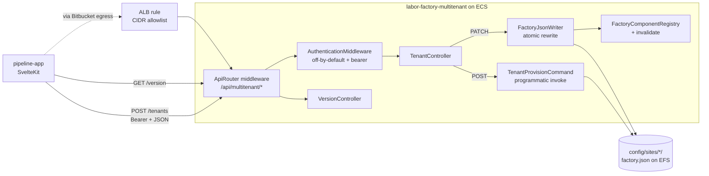

# 013 — Multitenant API & Live Capability Updates

## Background

Design Log #011 landed shared-tenant TYPO3 with per-site `factory.json`, `TenantScopeEnforcer`, and `factory:tenant:provision`. Design Log #012 amended Part A so the shared-tenant production deploy lives in a separate Bitbucket repo (`labor-factory-multitenant`) consuming `labor-digital/factory-core` from Packagist.

Two follow-ons block the next workflow tier (AI-generated seeds → tenant deployments without a redeploy cycle):

1. **Tenant provisioning is CLI-only.** `factory:tenant:provision` and `factory:tenant:audit` work on a developer laptop or via Bitbucket Pipelines manual jobs. There is no programmatic surface for the pipeline-app or any AI tooling to call.
2. **Capability changes (`active_components`, `active_record_types`) require either a redeploy or manual ssh-into-EFS-and-edit.** That defeats the point of shared tenancy for the long-tail clients DL #011 targets.

## Problem

- **No HTTP API** for `POST /tenants` (create) or `PATCH /tenants/{slug}` (update capabilities). Pipeline-app's `shared-tenant` mode emits a shell script for manual execution; there is nothing to automate against.
- **`FactoryComponentRegistry` static-caches `factory.json`** (`$config` line 26, `$siteConfigs` line 29 in [factory-core/typo3-extension/Classes/Configuration/FactoryComponentRegistry.php](../factory-core/typo3-extension/Classes/Configuration/FactoryComponentRegistry.php)). PHP-FPM workers persist these between requests; rewriting `factory.json` on disk is necessary but not sufficient for a request hitting the same worker afterward.
- **No version-compatibility contract.** Pipeline-app cannot tell whether a seed produced against factory-core `0.2.x` can be safely posted to a staging instance still on `0.1.x`.
- **Local seed iteration requires a full container rebuild.** Today's `factory:seed:init` is scoped to first-boot bootstrap. There is no "wipe-and-reseed against the running instance" command, so a seed tweak costs 60–90s of Docker churn instead of 1–2s of DataHandler work.
- **The deploy repo is an undocumented sibling clone.** New devs have to be told it exists. We can't add a git submodule because the Factory monorepo is public — `.gitmodules` would leak the private Bitbucket URL and a deploy-state SHA pointer.

## Questions and Answers

1. **Where does the API extension live in the monorepo?**
   — A new top-level package directory `factory-core/typo3-multitenant-api/` (sibling to `factory-core/typo3-extension/`). Reuses the existing release-please monorepo split + Packagist mirror flow. Published as `labor-digital/factory-multitenant-api`.

2. **Why a separate extension instead of folding the API into `factory_core`?**
   — Single-tenant clients must not ship the API. Keeping it as a separate Composer package (`composer require labor-digital/factory-multitenant-api`) makes opt-in explicit. `factory_core` stays the safe default for dedicated installs.

3. **TYPO3 routing approach?**
   — PSR-15 middleware at `/api/multitenant/*`, registered in `Configuration/RequestMiddlewares.php` **before** `typo3/cms-frontend/site-resolver`. The API operates *across* sites (one PATCH targets one tenant slug, not the current site context) — Extbase plugins and per-site routes don't fit. Middleware also matches the existing factory-core idiom (no Extbase usage to date).

4. **Auth model?**
   — Shared-secret bearer token. Two env vars are required for the middleware to even respond: `FACTORY_MULTITENANT_API_ENABLED=true` AND `FACTORY_MULTITENANT_API_TOKEN=<non-empty>`. Without both, every `/api/multitenant/*` request returns 404 (not 401 — we don't want to advertise the existence of the endpoint to unauthorized callers). Token comparison uses `hash_equals()`. mTLS, HMAC-on-bearer, and per-slug allowlists are deferred (Out of Scope).

5. **Is exposing this code in a public repo safe?**
   — Yes, with deployment hardening. The factory-core tenant primitives (`TenantProvisionCommand`, `TenantScopeEnforcer`, etc.) are already on Packagist; their internals aren't a secret. What matters is that the deployed API is gated by (a) the off-by-default env flags above, (b) ALB CIDR allowlist for `/api/multitenant/*`, and (c) audit logging. None of these depend on the source being private.

6. **How does the deploy repo get linked from Factory?**
   — **Sibling-clone convention, no submodule.** A submodule on a public repo would expose the private Bitbucket URL and SHA pointer. The convention is documented in this design log and validated by pipeline-app via a `multitenantRepoPath` config field (default `../labor-factory-multitenant`). The public README mentions only that "a separate deploy repo exists, see internal docs."

7. **How does `PATCH /tenants/{slug}` take effect without a redeploy?**
   — Three changes happen in one request:
     1. Atomic rewrite of `config/sites/{slug}/factory.json` (`tempnam` + `rename`).
     2. `FactoryComponentRegistry::invalidate($slug)` clears the static cache **on the worker handling the PATCH**.
     3. TYPO3 cache flush on `pages` + `runtime` via `CacheManager`.
   Caveat: ECS runs N tasks; PATCH lands on one worker. Other tasks' static `$siteConfigs` stay stale until their workers recycle (PHP-FPM `pm.max_requests` or natural traffic eviction) — typically <60s. v1 accepts this with a `warning` field in the API response. v2 follow-up: move the registry to a shared cache backend (Redis).

8. **Compatibility model — exact pin or range?**
   — Composer-semver range. Seed JSON declares `core_version: "^0.1"` (not `0.1.3`) so it tolerates patches. `GET /api/multitenant/version` returns the deployed `factory_core_version` plus `supported_seed_schema: {min, max}` for the seed JSON shape itself. Pipeline-app applies composer-semver semantics: `^x.y` matches deployed when `deployed >= x.y && deployed < (x+1).0`.

9. **What if the seed needs a newer factory-core than what's deployed?**
   — Pipeline-app blocks the run, surfaces the exact `composer require labor-digital/factory-core:^X.Y` command for the deploy repo, and links to its Bitbucket Renovate PR list. v1 does not auto-create a Renovate PR — link only. v2: programmatic Bitbucket PR via the REST API. A force-override is allowed but tags the run as `version-mismatch` in the SSE event log.

10. **Where does `factory:seed:reset` belong?**
    — In factory-core, sibling of `InitSeederCommand` at [factory-core/typo3-extension/Classes/Command/](../factory-core/typo3-extension/Classes/Command/). Reuses `ContentBlockSeeder`. Out-of-band of the API extension because it's useful in dedicated-instance setups too (fast local iteration during component dev).

## Design

### Architecture



### A. Sibling-clone documentation (WS-1)

Public-safe convention, no SHAs:

- This design log is the canonical reference: clone `labor-factory-multitenant` as a sibling of Factory at `../labor-factory-multitenant`. URL is in private LABOR docs.
- Pipeline-app adds a `multitenantRepoPath` config field (default `../labor-factory-multitenant`). Validated when `targetEnvironment === 'staging'` (DL #014).
- Public `README.md` mentions only that a separate private deploy repo exists.

### B. New extension `factory-multitenant-api` (WS-2)

**Package**: `labor-digital/factory-multitenant-api`, GPL-2.0-or-later, TYPO3 ^v13.4.27, depends on `labor-digital/factory-core: ^0.1`.

**File layout** (`factory-core/typo3-multitenant-api/`):
```
composer.json
ext_emconf.php
README.md
CHANGELOG.md
Configuration/
  RequestMiddlewares.php       # registers ApiRouter
  Services.yaml                # DI for controllers + middleware
Classes/
  Middleware/
    ApiRouter.php              # path-prefix gate, dispatches to controllers
    AuthenticationMiddleware.php  # off-by-default + bearer check
  Controller/
    TenantController.php       # POST/PATCH/GET handlers
    VersionController.php      # GET /version
  Service/
    FactoryJsonWriter.php      # atomic merge + rewrite + cache invalidate
    AuditLogger.php            # structured log lines for every request
```

**Routes** (all under `/api/multitenant`):

| Method | Route | Handler | Notes |
|---|---|---|---|
| GET | `/version` | VersionController::version | Returns `{factory_core_version, factory_multitenant_api_version, typo3_version, supported_seed_schema:{min,max}}` |
| GET | `/tenants` | TenantController::list | Enumerates `config/sites/*/factory.json` |
| GET | `/tenants/{slug}` | TenantController::get | Single tenant |
| POST | `/tenants` | TenantController::create | Calls `TenantProvisionCommand` programmatically |
| PATCH | `/tenants/{slug}` | TenantController::patch | Atomic rewrite + cache invalidate |

**Programmatic invocation of `TenantProvisionCommand`** (POST handler):
```php
$input = new ArrayInput([
    '--slug' => $body['slug'],
    '--domain' => $body['domain'],
    '--display-name' => $body['displayName'],
    '--components' => implode(',', $body['components']),
    '--admin-email' => $body['adminEmail'],
]);
$output = new BufferedOutput();
$exit = $this->provisionCommand->run($input, $output);
return new JsonResponse([
    'slug' => $body['slug'],
    'status' => $exit === 0 ? 'ready' : 'failed',
    'log' => $output->fetch(),
    'warning' => 'capability changes propagate to all instances within ~60s',
]);
```

The command is already DI-friendly (constructor takes `ConnectionPool`, `PasswordHashFactory`); we never shell out.

**Off-by-default gate** (the security-critical control):
```php
final class AuthenticationMiddleware implements MiddlewareInterface
{
    public function process(ServerRequestInterface $request, RequestHandlerInterface $handler): ResponseInterface
    {
        $enabled = getenv('FACTORY_MULTITENANT_API_ENABLED') === 'true';
        $token = (string)getenv('FACTORY_MULTITENANT_API_TOKEN');
        if (!$enabled || $token === '') {
            // 404, not 401 — don't advertise the endpoint
            return new HtmlResponse('Not found', 404);
        }
        $header = $request->getHeaderLine('Authorization');
        if (!str_starts_with($header, 'Bearer ') || !hash_equals($token, substr($header, 7))) {
            return new JsonResponse(['error' => 'unauthorized'], 401);
        }
        return $handler->handle($request);
    }
}
```

### C. `FactoryComponentRegistry::invalidate()` (WS-3)

Additive change in factory-core:
```php
public static function invalidate(?string $siteIdentifier = null): void
{
    if ($siteIdentifier === null) {
        self::$siteConfigs = [];
        self::$config = null;
        return;
    }
    unset(self::$siteConfigs[$siteIdentifier]);
}
```

`FactoryJsonWriter::write()` calls it after the `rename()` succeeds, plus:
```php
$cacheManager = GeneralUtility::makeInstance(CacheManager::class);
$cacheManager->getCache('pages')->flush();
$cacheManager->getCache('runtime')->flush();
```

### D. `factory:seed:reset` (WS-4)

New command at [factory-core/typo3-extension/Classes/Command/ResetSeederCommand.php](../factory-core/typo3-extension/Classes/Command/ResetSeederCommand.php):

- Flags: `--seed-template <slug>` (required), `--site=<slug>` (default `factory_base`), `--lang <list>` (default `de,en`), `--keep-admin` (default true).
- Wipes `pages` + `tt_content` for the site root + factory record tables (`tx_factorycore_*`) for that site only.
- Reuses `ContentBlockSeeder` to rebuild content from the seed template.
- Idempotent — running it twice is safe.

Shape mirrors `InitSeederCommand` (same DI deps, same DataHandler usage).

### E. Audit logging

Every API request emits a structured log line via TYPO3's standard PSR-3 logger (`Logger` from `getLogger(__CLASS__)`), formatted as JSON so CloudWatch can parse it:
```json
{"ts":"2026-05-08T14:22:01Z","route":"POST /tenants","slug":"acme","ip":"10.0.0.42","outcome":"created","duration_ms":1820}
```

### F. ALB + ECS wiring (in the deploy repo, not Factory)

Documented in `labor-factory-multitenant/README.md`:
- ECS task definition adds two env vars from Secrets Manager.
- ALB rule for path `/api/multitenant/*` adds a CIDR allowlist condition (LABOR office IPs + Bitbucket Pipelines egress for the staging caller).
- Bitbucket Pipelines variable for the bearer token.

### G. Tenant persistence (the file the API actually writes)

`POST /tenants` and `PATCH /tenants/{slug}` mutate
`/var/www/html/config/sites/{slug}/factory.json` (and `config.yaml`).
That path **must persist across ECS task replacements** — otherwise
new tenants would be ephemeral and we'd be back to per-tenant
redeploys, which the whole API exists to avoid.

**Mechanism**: LABOR's base image mounts EFS at `/var/www/html_data/`
(the same volume `fileadmin/` lives in). `opt/bootstrap.sh` in the
deploy repo runs on every container boot and symlinks the
application path into EFS:

```bash
ensure_dir /var/www/html_data/sites
rm -rf /var/www/html/config/sites
ln -sn /var/www/html_data/sites /var/www/html/config/sites
```

No task-def changes needed — the EFS mount already exists for
fileadmin; we just add another `rootDirectory` worth of files inside
it. Same pattern, zero new infrastructure. After this, every ECS
task in the service reads + writes to the same EFS-backed
`config/sites/`, so multi-task fanout (DL #013's "Multi-instance
caveat") is purely an in-memory cache concern — the on-disk truth is
unified.

**Implication for new tenants**: no redeploy needed. The API writes
a new `factory.json` on EFS at runtime, `FactoryComponentRegistry::
invalidate()` clears the in-process cache on the worker that handled
the call, other tasks catch up within ~60s on their natural worker
recycle. A fresh TYPO3 BE request on any task immediately sees the
new tenant in the site list.

## Implementation Plan

Tier 1 (parallelizable):
1. **WS-1 docs** — this design log doubles as the public-safe documentation. No code.
2. **WS-3** — add `FactoryComponentRegistry::invalidate()`. Single-method addition + a unit-test-style sanity check from the CLI.
3. **WS-4** — `ResetSeederCommand` scaffold; iterate against client-dummy locally.

Tier 2 (depends on WS-3):
4. **WS-2 scaffold** — extension dirs, `composer.json`, `ext_emconf.php`, `Configuration/Services.yaml`, empty `RequestMiddlewares.php`, README.
5. **WS-2 middleware** — `ApiRouter` (path/method dispatch) + `AuthenticationMiddleware` (off-by-default + bearer).
6. **WS-2 controllers** — `VersionController` first (smallest, validates the routing), then `TenantController.list/get/create/patch`.
7. **WS-2 release-please** — add the new package to `release-please-config.json` and the split-factory-core workflow so it gets its own Packagist mirror.

## Examples

### `POST /api/multitenant/tenants`

Request:
```http
POST /api/multitenant/tenants HTTP/1.1
Host: <staging-domain>
Authorization: Bearer <token>
Content-Type: application/json

{
  "slug": "acme",
  "domain": "acme.example.com",
  "displayName": "Acme Corp",
  "components": ["Button", "PageHero", "Text"],
  "recordTypes": [],
  "adminEmail": "ops@acme.example.com"
}
```

Response:
```json
{
  "slug": "acme",
  "status": "ready",
  "domain": "acme.example.com",
  "active_components": ["Button", "PageHero", "Text"],
  "log": "Provisioned tenant 'acme' …",
  "warning": "capability changes propagate to all instances within ~60s"
}
```

### `PATCH /api/multitenant/tenants/acme`

Request:
```json
{ "active_components": ["Button", "PageHero", "Text", "TextSlider"] }
```

Response:
```json
{
  "slug": "acme",
  "active_components": ["Button", "PageHero", "Text", "TextSlider"],
  "active_record_types": [],
  "settings": { … },
  "applied_at": "2026-05-08T14:22:01Z"
}
```

After this PATCH, the next BE page-edit request on the worker that handled the PATCH sees `TextSlider` in the "Add content" dialog without any cache flush. Other workers catch up within ~60s.

## Trade-offs

✅ **Off-by-default + 404 (not 401)** for unconfigured installs — single-tenant clients can `composer require` this extension by accident and not expose anything.

✅ **Live capability updates within one request** for the worker that processed the PATCH; all workers within ~60s. Good enough for v1; a Redis-backed registry is documented as the v2 follow-up.

⚠️ **No automatic Renovate PR creation** when a seed needs a newer factory-core. Pipeline-app links to the existing Renovate PR list and shows the exact `composer require` command. v2 closes this.

⚠️ **Bearer-only auth** in v1. mTLS and HMAC-on-bearer are documented as future work. The ALB CIDR allowlist is the hard outer perimeter.

⚠️ **Sibling-clone, not submodule** sacrifices "one-command clone everything" for "nothing leaks publicly." We accept the tribal-knowledge cost; the seed repo (DL #014) follows the same pattern, so the convention is consistent across all private linkages.
