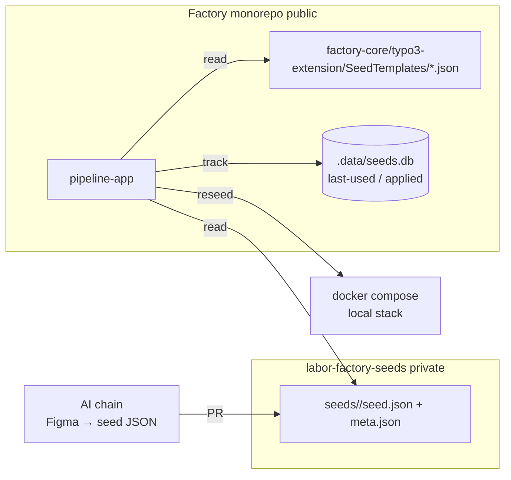

# 014 — Seed Library & Fast Local Reseed

## Background

DL #013 landed the multitenant API (`POST /tenants`, `PATCH /tenants/{slug}`) and the `factory:seed:reset` command. This log covers the **operator surface** in pipeline-app:

1. A persistent **seed library** the operator picks from, instead of editing the pipeline config by hand. Seeds are JSON payloads (factory.json-shaped) generated by an AI chain from Figma designs and dropped into a private Bitbucket repo.
2. **Fast local iteration**: re-apply a different seed to an existing local stack without `docker compose down` + rebuild. Two paths — theming-only hot-swap (no DB touch) and DB reseed (uses `factory:seed:reset`).

The environment selector + staging deploy + version-compat (WS-7) is deferred to DL #015 — it depends on a deployed staging API, which the team can stand up after this tier ships.

## Problem

- `pipeline-app/src/routes/api/templates/+server.ts` reads seeds only from `factory-core/typo3-extension/SeedTemplates/`. Those are the *built-in* synthetic seeds; we have no place for AI-generated, customer-derived seeds.
- Real customer seeds must NOT live in the public Factory monorepo. Storage has to be a private repo.
- Today's iteration loop is "edit pipeline config → run full pipeline" which tears down and rebuilds the docker stack. Even the cheapest path costs ~60s. We want sub-2s for theming changes and ~5s for content changes.
- Seed diffing logic doesn't exist. The operator has to know whether their change "needs a DB reseed."

## Questions and Answers

1. **Where do AI-generated seeds live?**
   — A new private Bitbucket repo `labor-factory-seeds`, sibling-cloned next to Factory at `../labor-factory-seeds` (configurable via `seedsRepoPath`). Same model as `labor-factory-multitenant` (DL #013). Layout:
   ```
   labor-factory-seeds/
     _schema.json
     README.md
     seeds/<slug>/
       seed.json     # factory.json-shaped payload (active_components, settings, …)
       meta.json     # { id, name, slug, description, source, coreVersion, createdAt, thumbnail? }
       thumbnail.png # optional
   ```

2. **Why not a SQLite DB inside pipeline-app for seeds?**
   — Seeds need git history + PR review + cross-machine sync. A pure DB has none of that for AI-generated content. We *do* keep a small SQLite at `pipeline-app/.data/seeds.db` — gitignored, rebuildable from files — purely as a metadata index for `lastUsedAt` and `lastAppliedTo` (for the diff in WS-6).

3. **What about the existing built-in templates?**
   — Stay where they are (`factory-core/typo3-extension/SeedTemplates/`). Pipeline-app reads BOTH sources and tags each entry with origin: `builtin` (from factory-core) or `library` (from the seeds repo). Operators see one combined list.

4. **How does an AI-generated seed get into the library?**
   — File drop is the primary path: the AI chain writes the two files into a working tree of `labor-factory-seeds`, opens a PR, gets review, merges. After `git pull` on the dev machine, pipeline-app's `GET /api/seeds` rescans on next call. Manual upload via UI (`POST /api/seeds`) is a fallback that writes the same two files locally; the user is responsible for committing.

5. **Theming-only vs DB-reseed — how does pipeline-app decide?**
   — A pure data diff between the *currently applied* seed (tracked in `seeds.db`) and the new seed:
     - Any change in `active_components`, `active_record_types`, or template `elements`/page tree → DB reseed (calls `factory:seed:reset`).
     - Only changes in `settings.colors|fonts|breakpoints|radius|colorMode|placeholderImageBaseUrl` → theming-only hot-swap.
     - All equal → no-op (still allow the operator to force re-apply).
   The operator can override the auto-decision (`force: 'db-reseed' | 'theming-only'`).

6. **What does the theming-only path actually do?**
   — Rewrites `<projectRoot>/<testProjectName>/frontend/app/src/factory.json` and `…/backend/app/src/factory.json` `settings` blocks (same shape as the existing scaffold-settings step in `executor.ts`). Then `docker compose exec frontend touch /var/www/html/factory.json` to wake Nuxt's HMR. No DB call. Sub-second after the file write.

7. **What does the DB-reseed path do?**
   — Rewrites the same two `factory.json` files (both `active_components` and `settings`) AND runs `docker compose exec -w /var/www/html app vendor/bin/typo3 factory:seed:reset --seed-template <slug> --site=<slug> -y` followed by `cache:flush`. ~5s on a warm container.

8. **Does the operator stay on the existing form, or is there a new picker UI?**
   — A dedicated `/seeds` page with cards. Selecting "Use" pre-fills the existing form via query string (`?seed=<slug>`). Once the picker is canon, the form's "templateSlug" field becomes a derived display rather than a free input.

9. **What happens when the seeds repo isn't cloned?**
   — `GET /api/seeds` returns the builtin entries plus a `warnings` array describing the missing path. The `/seeds` UI shows a banner with the exact `git clone` command (the URL is in private docs — banner only references the convention path).

## Design

### Architecture



### A. PipelineConfig additions

Add to `pipeline-app/src/lib/pipeline/types.ts`:
```ts
export type SeedSource = 'builtin' | 'library';

export interface SeedLibraryEntry {
  id: string;
  name: string;
  slug: string;
  source: SeedSource;
  description: string;
  coreVersion: string;
  components: string[];
  recordTypes: string[];
  settings?: Partial<FactorySettings>;
  thumbnailPath?: string;
  createdAt?: string;
  lastUsedAt?: string;
  origin: { kind: 'figma' | 'ai-prompt' | 'manual' | 'builtin'; figmaUrl?: string; prompt?: string; model?: string };
  // Only present when reading from the library; not from builtin templates
  payloadPath?: string;
}
```

Add to `PipelineConfig`: `seedsRepoPath: string` (default `../labor-factory-seeds`).

### B. Seed store (filesystem reader)

`pipeline-app/src/lib/seeds/store.ts`:
- `listSeeds(seedsRepoPath, factoryCorePath)` → `{ entries: SeedLibraryEntry[]; warnings: string[] }`
- Reads built-ins from `<factoryCorePath>/typo3-extension/SeedTemplates/*.json`.
- Reads library from `<seedsRepoPath>/seeds/*/{seed.json,meta.json}`. Returns warning entries for missing repo or invalid files (don't throw — degrade).
- `loadSeed(seedsRepoPath, factoryCorePath, slug)` → full seed JSON ready to apply.
- `writeSeed(seedsRepoPath, slug, seed, meta)` for `POST /api/seeds`. Throws if the repo path is missing.

### C. API routes

- `pipeline-app/src/routes/api/seeds/+server.ts` — `GET` list, `POST` create.
- `pipeline-app/src/routes/api/seeds/[slug]/+server.ts` — `GET` single, `DELETE` remove (library only — refuses on `builtin`).

### D. Diff helper

`pipeline-app/src/lib/seeds/diff.ts`:
- `diffSeeds(current: AppliedSeedSnapshot | null, next: SeedJson): { mode: 'no-op' | 'theming-only' | 'db-reseed'; reasons: string[] }`
- `current` is loaded from the SQLite index (or null if nothing tracked yet).

### E. Reseed runner

`pipeline-app/src/lib/pipeline/reseed.ts`:
- `runReseed(config: ReseedRequest, emit: Emit, signal: AbortSignal)` mirrors the SSE shape of `runPipeline`.
- `theming-only`: rewrite both `factory.json` settings blocks → `docker compose exec frontend touch …`.
- `db-reseed`: rewrite both `factory.json` (settings + active_components + active_record_types) → `docker compose exec app vendor/bin/typo3 factory:seed:reset --seed-template <slug> -y` → `cache:flush`.
- After success, write the applied snapshot into `.data/seeds.db`.

`pipeline-app/src/routes/api/reseed/+server.ts` mirrors the existing `routes/api/pipeline/+server.ts` pattern (NDJSON stream over `Transfer-Encoding: chunked`).

### F. UI

- `pipeline-app/src/routes/seeds/+page.svelte` — grid of `SeedCard.svelte` instances, with a search + filter chip row.
- `SeedCard.svelte` — thumbnail or color-swatch fallback, name, description (clamp 2 lines), `core_version` badge, component count, color preview row (5 swatches), `lastUsedAt` relative time. Kebab: Use / Edit metadata / Duplicate / Delete / Download.
- "Use" routes to `/?seed=<slug>` which the existing form reads on mount.
- "Apply to running stack" appears on each card when the stack is detected (heuristic: `<projectRoot>/<testProjectName>/.up.lock` exists, or simply when the project dir exists). Triggers `/api/reseed`.

## Implementation Plan

1. Types + schema definition.
2. `lib/seeds/store.ts` (no SQLite yet — files only; SQLite is additive in a later commit).
3. `lib/seeds/diff.ts`.
4. API routes (`/api/seeds`, `/api/seeds/[slug]`).
5. `lib/pipeline/reseed.ts` + `/api/reseed`.
6. UI: `SeedCard.svelte` + `routes/seeds/+page.svelte`.
7. Bootstrap the local `labor-factory-seeds` clone with `_schema.json` + `README.md` + a synthetic example seed.

## Examples

### `GET /api/seeds`
```json
{
  "entries": [
    { "id": "builtin-cb-collection", "slug": "cb-collection", "source": "builtin", "name": "CB Collection demo", … },
    { "id": "library-acme-fall-2026", "slug": "acme-fall-2026", "source": "library", "name": "Acme Fall 2026", "coreVersion": "^0.1", … }
  ],
  "warnings": []
}
```

### `POST /api/reseed`
Request:
```json
{ "seedSlug": "acme-fall-2026", "force": null, "projectName": "test-client-auto" }
```
Response: NDJSON stream of `StepEvent`s identical in shape to the existing pipeline stream.

## Trade-offs

✅ **Files-on-disk for seeds** keeps git history + PR review for AI-generated content. The SQLite index is a derived cache, not a source of truth.

✅ **Combined builtin + library list** keeps the operator on one screen. Origin is visible on each card so there's no confusion.

✅ **Theming-only path is sub-second** — Nuxt HMR reloads the page on the file watcher event. Good enough for design tweaks.

⚠️ **Diff is structural, not semantic.** Reordering the `elements` array of a template will count as a "DB reseed required" change even if the rendered output is identical. v2 can do a content-hash diff.

⚠️ **No multi-language picker per seed.** The `--lang de,en` default flows through. v2 follow-up if seeds want to override.

⚠️ **Auto-detection of "stack is running" is naive.** v1 just checks the project dir's existence; the user can still hit "Apply" against a not-running stack and get an error. We surface the error clearly rather than over-engineer detection.
