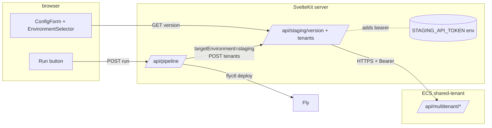

# 015 — Environment Selector, Version Compat, Staging Deploy

## Background

DL #013 published the multitenant API (`POST /tenants`, `PATCH /tenants/{slug}`, `GET /version`). DL #014 added the seed library + fast local reseed in pipeline-app. With both in place, operators can build a tenant locally end-to-end.

What's still missing is the bridge that lets pipeline-app send a tenant straight to a staging shared-tenant instance instead of the local Docker stack — and refuse to do so when the seed's `core_version` outruns what's deployed.

## Problem

- Pipeline-app has no `targetEnvironment` notion. It scaffolds locally or publishes to Bitbucket; there is no "create this tenant on staging right now" path.
- `factory-core 0.2.0` and `factory-multitenant-api 0.1.1` are now Packagist-installable, but pipeline-app cannot detect what version a given staging instance has deployed. Sending an `^0.2` seed to a `^0.1` deploy crashes at `PATCH` time (no `invalidate()` method).
- The staging API bearer token lives in the operator's environment. It must never leave the SvelteKit server — the browser cannot see it. Today the existing flyApiToken/bitbucketToken pattern is the only template for this; we replicate it for the staging API.
- Production isn't ready. The selector must visibly surface a `prod` segment but keep it disabled until the next milestone (1.0).

## Questions and Answers

1. **Where does the staging API base URL come from?**
   — A new `stagingApiBaseUrl` field on `PipelineConfig`, configurable per-operator and persisted via the existing `localStorage('pipeline-config')` mechanism. Default empty → "staging not configured" surface in the UI.

2. **Where does the bearer token live?**
   — `STAGING_API_TOKEN` env var on the SvelteKit server (same shape as `BITBUCKET_TOKEN`, `FLY_API_TOKEN`). Never serialized to the client. The form only sees a boolean `stagingApiTokenConfigured` from `GET /api/pipeline`.

3. **How does pipeline-app reach the staging API without exposing the token in the browser?**
   — Server-side proxy routes under `/api/staging/*`. The browser hits the local SvelteKit route; the route attaches the bearer; the bearer never crosses the wire to the operator's machine. Mirrors the existing `/api/pipeline` + token pattern.

4. **What's the version-compat algorithm?**
   — Composer-style caret semantics in JS. `^x.y` matches deployed when `deployed >= x.y && deployed < (x+1).0`. The seed declares `core_version: "^0.2"` (NOT an exact pin, never a pin); `GET /api/multitenant/version` returns `factory_core_version: "0.2.0"` (exact). Match → green; mismatch → red + remediation hint.

5. **What does mismatch remediation look like in v1?**
   — A red badge plus a code block showing the exact `composer require` command for the deploy repo:
     ```
     cd ../labor-factory-multitenant/src
     composer require labor-digital/factory-core:^0.2
     git commit -am "bump factory-core" && git push
     ```
   Plus a deep-link to the deploy repo's Bitbucket Renovate PR list. v1 does NOT auto-create a Renovate PR. The operator can force-override; the run is tagged `version-mismatch` in the SSE event log.

6. **Does the staging path skip the local docker phases entirely?**
   — Yes. When `targetEnvironment === 'staging'`, the runner skips Phase 0 (teardown), Phase 3 (docker bootstrap), and Phase 4 (Bitbucket publish — that's the local-frontend flow). It still runs Phases 1–2 (scaffolding + component injection) so the on-disk artifacts exist for `flyctl deploy` to consume. The new "Phase S" replaces the missing tail: pre-flight version check → POST to staging API → poll → flyctl deploy.

7. **What does the staging API receive?**
   — A `TenantSpec`-shaped payload identical to what `factory:tenant:provision` accepts via CLI, plus the seed's `core_version` so the API can re-check on its end. The API answers with the `TenantController::create` response shape from DL #013 (`{slug, status:'ready', tenant:{…}, log, warning}`).

8. **What does the frontend deploy step look like for staging?**
   — `flyctl deploy --remote-only --config <fly.toml> --app <app>`. Reuses the pattern from `provisionFlyIoFrontend` in `executor.ts`. The Fly app name follows the existing convention (`<bitbucketRepoSlug>-frontend` or similar — fall back to `<seedSlug>-frontend` when not set).

9. **What about prod?**
   — Render the segment, mark it disabled, tooltip "Disabled until 1.0". No code path. We add the type today so `targetEnvironment: 'prod'` is reachable but every code site treats it the same as `local` for safety until the prod multitenant instance is provisioned.

## Design

### Architecture



### A. Type + config additions

`pipeline-app/src/lib/pipeline/types.ts`:
```ts
export type TargetEnvironment = 'local' | 'staging' | 'prod';

// Subset of the GET /api/multitenant/version response — what pipeline-app actually consumes.
export interface DeployedVersionInfo {
  factoryCoreVersion: string;
  factoryMultitenantApiVersion: string;
  typo3Version: string;
  supportedSeedSchema: { min: string; max: string };
}

export interface VersionCompatResult {
  deployed: DeployedVersionInfo | null;
  seedConstraint: string;            // e.g. "^0.2"
  matches: boolean;
  reason: string;                    // human-readable diagnosis
  remediation?: { composerRequire: string; renovateLinkHint: string };
}
```

Add to `PipelineConfig`:
- `targetEnvironment: TargetEnvironment` (default `'local'`)
- `stagingApiBaseUrl: string` (default empty)
- `stagingApiTokenConfigured: boolean` (server reports, not user input)
- `forceVersionMismatch: boolean` (default false; toggled per run)

### B. Server-side staging proxy

`pipeline-app/src/routes/api/staging/version/+server.ts` — `GET`:
- Reads `STAGING_API_TOKEN` from env (`$env/dynamic/private`).
- Reads `stagingApiBaseUrl` from query string (or 400 if missing).
- Fetches `<base>/api/multitenant/version` with the bearer; relays the JSON.
- Caches in-memory for 30s to avoid hammering the API on form changes.

`pipeline-app/src/routes/api/staging/tenants/+server.ts` — `POST`:
- Forwards the request body to `<base>/api/multitenant/tenants` with the bearer.
- Streams the response back; on success returns the same shape as the upstream.

`pipeline-app/src/routes/api/staging/tenants/[slug]/+server.ts` — `GET`:
- Polls `<base>/api/multitenant/tenants/{slug}` once per call. Used by the staging executor's poll loop.

`pipeline-app/src/routes/api/pipeline/+server.ts` extended to report `stagingApiTokenConfigured: !!getStagingApiToken()` alongside the existing token flags.

### C. Version-compat helper

`pipeline-app/src/lib/staging/versionCompat.ts`:
- `parseConstraint(input: string): {kind:'caret', major:number, minor:number} | null` — supports only `^x.y` for v1; rejects exact pins (returns null with reason).
- `satisfies(deployed: string, constraint: string): boolean`.
- `evaluate(seedCoreVersion: string, deployed: DeployedVersionInfo | null): VersionCompatResult`.
- The `remediation` block hardcodes the deploy repo path the README expects: `../labor-factory-multitenant/src`. (Sibling-clone convention from DL #013.)

### D. UI

`pipeline-app/src/lib/components/EnvironmentSelector.svelte`:
- Three segmented buttons: `Local | Staging | Prod`.
- `Prod` is disabled with tooltip "Disabled until 1.0".
- When `Staging` is selected: input for `stagingApiBaseUrl`, badge for `stagingApiTokenConfigured`, and an embedded `<VersionCompatBadge />`.

`pipeline-app/src/lib/components/VersionCompatBadge.svelte`:
- Fetches `/api/staging/version` on mount + when `stagingApiBaseUrl` changes.
- Reads the currently-selected seed's `core_version` from the parent (prop).
- Renders green/red dot + "Staging factory-core: 0.2.0 · Seed needs ^0.2" line.
- On red, shows the `composer require` snippet inline.

The selector + badge live at the top of `ConfigForm.svelte`. Run button gains a `disabled` reason when `targetEnvironment === 'staging'` and version mismatch isn't forced.

### E. Staging execution path

`pipeline-app/src/lib/pipeline/executor.ts` — extend `runPipeline`:
- Branch on `config.targetEnvironment` after Phase 2 (component injection).
- For `local` → today's flow (Phase 3 + 4).
- For `staging` → new `runStagingPhase()`:
  1. Re-check version (defense in depth — operator may have changed seed since last UI fetch).
  2. `POST /api/staging/tenants` with the seed payload.
  3. Poll `GET /api/staging/tenants/{slug}` until `status: 'ready'` or 5min timeout. Stream poll updates as `step:output`.
  4. `flyctl deploy --remote-only --config <projectDir>/frontend/app/fly.toml --app <appName>` — reuse the existing `runFlyDeploy` helper if extractable, else duplicate the spawn shape.
- For `prod` → emit a `pipeline:error` ("Production target disabled until 1.0") and stop.

### F. Phase model

The `PHASES` constant becomes derived from `targetEnvironment`. For `staging`, the visible phases are:
- Phase 1: Scaffolding (existing)
- Phase 2: Component Injection (existing)
- Phase S: Staging Deploy (new — combined version-check + POST + poll + flyctl)

For `local`, the existing 0–4 set stays.

## Implementation Plan

1. Types + config defaults.
2. Server-side proxy routes (3 endpoints).
3. Version-compat helper + unit-style test fixture in a comment block.
4. EnvironmentSelector + VersionCompatBadge components.
5. Staging execution path in executor.ts.
6. ConfigForm wiring + main page integration.
7. svelte-check.

## Examples

### Compat-match path
1. Operator picks staging + seed `acme-fall-2026` (declares `core_version: "^0.2"`).
2. `/api/staging/version` returns `{factory_core_version: "0.2.0", …}`.
3. Badge: green, "Staging factory-core: 0.2.0 · seed ^0.2 ✓".
4. Run → POST to staging API → tenant ready in ~3s → flyctl deploy → done.

### Compat-mismatch path
1. Same as above but staging is on `0.1.1`.
2. Badge: red, "Staging factory-core: 0.1.1 · seed needs ^0.2 ✗".
3. Inline snippet: `cd ../labor-factory-multitenant/src && composer require labor-digital/factory-core:^0.2 && git commit -am "bump factory-core" && git push`.
4. Run button disabled. Force-override checkbox available; if used, run is tagged `version-mismatch` in the event log.

## Trade-offs

✅ **Server-side proxy keeps the bearer out of the browser.** Same hardening as the existing Bitbucket / Fly token handling.

✅ **Composer-style caret semantics** match what the seed JSON already declares — operators don't have to learn a second versioning grammar.

⚠️ **Polling instead of webhooks** for `tenant:ready`. The multitenant API's `POST /tenants` could become async with a job ID, but for v1 it's synchronous (per DL #013) — we just poll the GET to be defensive. v2 can switch to a Location header / job queue pattern.

⚠️ **No automatic Renovate PR creation.** Operator copies the `composer require` snippet and commits manually. v2 follow-up uses the Bitbucket REST API to open the PR.

⚠️ **Prod stays a UI placeholder.** No code path. The `'prod'` literal exists in the type so future work can compile; every executor branch falls through to "disabled" until prod infra is ready.

⚠️ **In-memory 30s cache for `/api/staging/version`.** Per-process, so a SvelteKit dev-server restart drops it. Good enough for an internal tool; trade for Redis if pipeline-app ever runs multi-instance.
