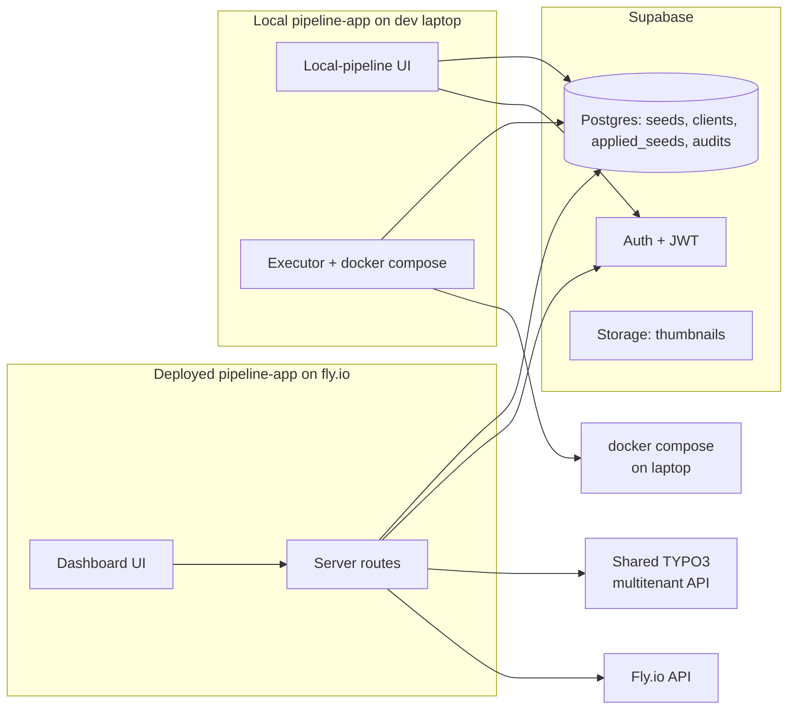

# 017 — Pipeline-App: Dashboard Redesign & Supabase Backend

## Background

DL #004 created `pipeline-app` as a SvelteKit "two-slide" tool: a config form on the left, an execution view on the right. DL #014–#016 layered on seed library, environment selector, version-compat, tenant lifecycle. Each addition was correct in isolation, but the cumulative effect is a single page with a 600-LOC `ConfigForm` exposing ~30 orthogonal fields. The operator now toggles "deployment mode," "operating mode," "target environment," "include Phase 3/4," and "factory-core source" — each unlocking or hiding sub-blocks. Easy to misconfigure. Hard to onboard a new developer.

Two parallel pressures sharpen the problem:

1. **AI-generated seeds** (DL #014) now produce most of what used to be hand-configured: components, record types, design tokens, page content. Once a seed exists, ~70 % of the form fields are noise.
2. **Local vs Staging/Prod** are structurally different jobs — Phase 0/3 (Docker teardown, sudo, full stack rebuild) is local-only; Phase S (version compat → multitenant API → flyctl) is staging-only. The current UI fakes a single pipeline with conditionals; it should be two distinct flows.

This log also reverses one DL #014 decision: seeds will move from a private git repo (`labor-factory-seeds`) into **Supabase**. Rationale below.

## Problem

- One-pager UI is overwhelmed and hard to scan.
- No team-wide view of state: which seeds exist, which clients/tenants are running, on which fly.io machines, at which `factory-core` version. Each dev has to clone the private seeds repo, run pipeline-app locally, and infer state from disparate places.
- Seeds-as-JSON-in-git gives PR review but blocks non-engineers from authoring or browsing, and forces a clone-and-pull dance.
- No identity model: the tool runs unauthenticated as a local dev utility. Nothing prevents two devs from racing on the same staging tenant.
- Fly.io control is shell-driven (`flyctl …`); there's no operator surface to see machine state across tenants, or to bounce a stuck one.

## Questions and Answers

1. **Why Supabase, not Postgres + custom auth?**
   — Postgres + Auth + Row-level security + Storage (for thumbnails) in one managed surface. Env vars already set (`SUPABASE_URL`, `SUPABASE_PUBLISH_KEY`, `SUPABASE_SECRET_KEY`). Free tier is sufficient for our team size; we can move to self-hosted Postgres later without touching app code if we keep our SDK use to PostgREST + standard auth.

2. **What happens to `labor-factory-seeds` (the git repo)?**
   — Retired as the source of truth. We export current seeds to Supabase once via a migration script (`pipeline-app/scripts/migrate-seeds-to-supabase.ts`), then archive the repo. The `_schema.json` becomes a Supabase column constraint / CHECK. Seeds are now rows; their JSON payload is a `jsonb` column.

3. **What replaces git review for seed changes?**
   — Two mechanisms: (a) Supabase audit log table (`seed_audits`) captures every write with `user_id`, `before`, `after`, `at`. (b) Seeds gain a `status` column (`draft` | `published`) — only a published seed can be applied to staging/prod. Promoting from draft → published is the review step. For internal velocity that's enough; if we ever need branch-and-PR semantics we can layer it on `seed_versions`.

4. **Will pipeline execution run on the deployed app?**
   — Partially. The deployed dashboard handles **staging and prod** pipelines (it has `STAGING_API_TOKEN`, `FLY_API_TOKEN`, `BITBUCKET_TOKEN` in its server env). **Local** pipelines must spawn `docker compose` against the operator's laptop — they can't run from a remote server. The local mode therefore continues to require running `npm run dev` locally; that local instance reads the same Supabase, so seeds/clients/tenants are shared across both surfaces.

5. **What about the existing builtin seeds in `factory-core/typo3-extension/SeedTemplates/`?**
   — Migrated to Supabase with `origin.kind = 'builtin'` and an immutable flag so they show in the picker but can't be edited from the UI (still editable in factory-core repo for the framework templates). Eventually deprecated in favour of `origin.kind = 'manual' | 'ai-prompt' | 'figma'`.

6. **What's the new information architecture?**
   ```
   /                  — Dashboard overview (counts, recent activity, live tenant/fly status)
   /seeds             — List + filter (status, origin, client)
   /seeds/[id]        — View / edit / promote a seed
   /seeds/new         — Create / paste / AI-generate
   /clients           — List
   /clients/[id]      — Detail: tenants, applied seeds, fly apps
   /tenants           — Live view of all tenants in staging (calls multitenant API)
   /tenants/[slug]    — Detail incl. fly machine status
   /fly               — Live list of fly.io apps across the org
   /pipeline/local    — Local-stack runner (slim form, derives most from seed + project name)
   /pipeline/staging  — Staging deploy (slim form: pick client → tenant → seed → run)
   /login             — Supabase auth (email/password)
   ```
   The current `+page.svelte` becomes the dashboard at `/`. The pipeline execution view (slide 2) becomes `/pipeline/[id]` so a run can be reopened, shared by URL, and not lost on refresh.

7. **Why live-query fly.io / multitenant API instead of caching?**
   — The user explicitly chose live for simplicity. Drift between cache and reality is the kind of bug that erodes trust in a dashboard. Live query latency is acceptable for an ops surface (<2s per page). We can add a thin server-side cache (30s TTL via Sveltekit `load` + `setHeaders`) later if traffic warrants.

8. **Auth model?**
   — Supabase Auth with email/password (no OAuth initially — the team is small and we control the user list manually via Supabase dashboard). Sveltekit `hooks.server.ts` gates every route except `/login`. All API routes verify the JWT and attach `locals.user`. RLS on seeds, clients, tenants tables ensures non-authenticated access (e.g., a misconfigured deploy) reads nothing.

9. **What survives from the current code?**
   — The pipeline executor (`src/lib/pipeline/executor.ts`), Phase ordering, NDJSON streaming, `factory:*` CLI invocations, `reseed.ts`, version-compat logic, the multitenant API client. None of that is the source of the UX problem. We rewrite **routes, components, the `PipelineConfig` shape, and the seed storage layer**, not the execution engine.

10. **Do we keep `factory.json` on disk?**
    — Yes. `factory.json` is read by Nuxt and TYPO3 at runtime — it must stay a file. Supabase is the source for what *should* be in `factory.json`; the executor writes it to disk as part of a run. The applied snapshot also goes into Supabase (`applied_seeds` table) so any dev can see "tenant X is running seed Y at version Z."

## Design

### Supabase schema (initial)

```sql
-- Clients (companies / customers)
create table clients (
  id uuid primary key default gen_random_uuid(),
  slug text unique not null,
  display_name text not null,
  notes text,
  created_at timestamptz default now(),
  created_by uuid references auth.users(id)
);

-- Seeds (the things you apply to a tenant)
create table seeds (
  id uuid primary key default gen_random_uuid(),
  slug text unique not null,
  name text not null,
  description text default '',
  status text not null default 'draft' check (status in ('draft','published','archived')),
  origin jsonb not null default '{"kind":"manual"}'::jsonb,
  core_version text not null,            -- composer-style range, e.g. "^0.2"
  payload jsonb not null,                -- factory.json-shaped: active_components, settings, elements, …
  suggested_tenants jsonb default '[]',  -- TenantSpec[]
  thumbnail_path text,                   -- supabase storage key
  client_id uuid references clients(id), -- null for generic / builtin
  immutable boolean default false,       -- true for migrated builtins
  created_at timestamptz default now(),
  updated_at timestamptz default now(),
  created_by uuid references auth.users(id),
  last_used_at timestamptz
);
create index seeds_status_idx on seeds(status);
create index seeds_client_idx on seeds(client_id);

-- Audit log for seed mutations (replaces git history)
create table seed_audits (
  id bigserial primary key,
  seed_id uuid references seeds(id) on delete cascade,
  at timestamptz default now(),
  user_id uuid references auth.users(id),
  action text not null,                  -- create | update | publish | archive | delete
  before jsonb,
  after jsonb
);

-- What is currently applied to a tenant (replaces local .data/seeds.db lastAppliedTo)
create table applied_seeds (
  id uuid primary key default gen_random_uuid(),
  environment text not null check (environment in ('local','staging','prod')),
  project_name text,                     -- local: project dir name
  tenant_slug text,                      -- staging/prod
  seed_id uuid references seeds(id),
  active_components text[] not null default '{}',
  active_record_types text[] not null default '{}',
  settings jsonb not null default '{}',
  factory_core_version text,
  applied_at timestamptz default now(),
  applied_by uuid references auth.users(id)
);
create unique index applied_seeds_local_idx on applied_seeds(environment, project_name) where environment = 'local';
create unique index applied_seeds_remote_idx on applied_seeds(environment, tenant_slug) where environment in ('staging','prod');
```

RLS: all tables `enable row level security` with `authenticated` role allowed full access initially. Tighten later by client_id if we ever onboard external collaborators.

### Architecture



### Deployment

- `pipeline-app/Dockerfile` — Node 22 alpine, `npm ci && npm run build`, `node build`.
- `pipeline-app/fly.toml` — single shared-cpu-2x-1024 in `fra`, `auto_stop_machines = "stop"` (cold start ~10s is fine for an internal tool). Same wake-on-request pattern as the client frontend fix in 213302f.
- Secrets via `flyctl secrets set` — `SUPABASE_URL`, `SUPABASE_SECRET_KEY`, `STAGING_API_TOKEN`, `FLY_API_TOKEN`, `BITBUCKET_TOKEN`.

## Implementation Plan

Phased to keep the existing app working while the new one grows beside it.

**Phase A — Foundation**
1. `npm i @supabase/supabase-js` in pipeline-app.
2. `src/lib/supabase/server.ts` (uses `SUPABASE_SECRET_KEY`, service role) and `src/lib/supabase/browser.ts` (uses `SUPABASE_PUBLISH_KEY`, anon).
3. `supabase/migrations/0001_init.sql` with the schema above.
4. `hooks.server.ts` — JWT validation, `locals.user`, redirect to `/login` for unauthenticated.

**Phase B — Seed data migration**
5. `scripts/migrate-seeds-to-supabase.ts` — read builtin + library JSON files, insert into `seeds` (immutable=true for builtins).
6. Rewrite `src/lib/seeds/store.ts` to query Supabase instead of disk. Keep `loadSeedPayload(seedId)` returning the same shape so `executor.ts` doesn't change.
7. `/api/seeds` returns Supabase rows; `POST /api/seeds` inserts; new `PATCH /api/seeds/[id]` updates; `POST /api/seeds/[id]/publish` for promotion.
8. Drop `.data/seeds.db` and the SQLite dependency entirely.

**Phase C — Dashboard IA**
9. `+layout.svelte` — top nav (Overview / Seeds / Clients / Tenants / Fly / Pipelines) and user menu.
10. New routes per IA above. The current `+page.svelte` content moves to `/pipeline/staging` and `/pipeline/local`; `/` becomes the overview.
11. `/clients`, `/clients/[id]` — CRUD against Supabase.
12. `/tenants`, `/tenants/[slug]` — live `GET /api/multitenant/tenants` (proxy through `/api/staging/tenants` which already exists).
13. `/fly`, `/fly/[appName]` — new server route `/api/fly/apps` that wraps the fly.io REST API (`https://api.machines.dev/v1/apps?org_slug=…`).

**Phase D — Slim pipeline forms**
14. `/pipeline/local` — fields collapse to: project name, seed picker (Supabase), factory-core source (local/npm), sudo password, run. Everything else derives from the seed.
15. `/pipeline/staging` — fields collapse to: client picker, mode (create/update), tenant slug + domain (suggested from seed), seed picker, run. Bitbucket workspace/key/repo/fly org/region/size become a one-time **team defaults** entity stored in Supabase, not a per-run form.
16. `PipelineConfig` splits into `LocalPipelineConfig` and `StagingPipelineConfig` (separate types). Executor branches at the entrypoint.

**Phase E — Deploy**
17. `pipeline-app/Dockerfile`, `pipeline-app/fly.toml`.
18. Bitbucket Pipeline (`bitbucket-pipelines.yml`) to deploy on push to main.

### Critical files

- New: `pipeline-app/src/lib/supabase/{server,browser}.ts`, `pipeline-app/supabase/migrations/0001_init.sql`, `pipeline-app/scripts/migrate-seeds-to-supabase.ts`, `pipeline-app/src/hooks.server.ts`, `pipeline-app/Dockerfile`, `pipeline-app/fly.toml`.
- Rewritten: `pipeline-app/src/lib/seeds/store.ts`, `pipeline-app/src/routes/+layout.svelte`, `pipeline-app/src/routes/+page.svelte`, all `/api/seeds*` endpoints.
- Reused as-is: `pipeline-app/src/lib/pipeline/executor.ts`, `reseed.ts`, `versionCompat.ts`, `factory:*` CLI plumbing.

### Trade-offs

- **No git history for seeds.** Mitigated by `seed_audits`. We lose blame-by-line; we gain a UI editable by non-engineers and a single shared source. Reversible: an export-to-git nightly job is trivial if we miss it.
- **Live-query latency.** Dashboard load = several network round-trips (Supabase + multitenant API + fly API). Acceptable for ops; if it bites, server-side `setHeaders('cache-control', 's-maxage=30, stale-while-revalidate=60')` on read-only routes.
- **Two surfaces (deployed + local).** Adds operational complexity vs. one place. The split is forced by the local-docker requirement; documenting it clearly in the UI ("This is the deployed dashboard — for local pipelines, run `cd pipeline-app && npm run dev` on your laptop") makes it tolerable.
- **Supabase lock-in.** We use Postgres + Auth + Storage. Auth is the stickiest part. If we ever migrate off, we'd reimplement those three. Worth it for the velocity now; revisit at 10+ users.

## Verification

- Migration: run `npx tsx scripts/migrate-seeds-to-supabase.ts`, then `select count(*) from seeds`. Equal to `builtin + library` file count.
- Auth: hit `/` unauthenticated → 302 `/login`. Log in → `/`. JWT visible in `locals.user`.
- Dashboard: counts on `/` match `select count(*)` for each entity.
- Tenants live view: kill the multitenant API → page shows a graceful "unreachable" panel, doesn't crash.
- Local pipeline: pick a seed from Supabase, run, observe `applied_seeds` row appearing after success.
- Staging pipeline: same, with `tenant_slug` set.
- Deploy: `flyctl deploy` succeeds, logging in as a real user works.

## Implementation Results — 2026-05-14 (Phases A–C + partial D + E)

**Phase A landed**
- `pipeline-app/package.json` — `@supabase/supabase-js` + `@supabase/ssr` added.
- `pipeline-app/src/lib/supabase/admin.ts` — service-role client.
- `pipeline-app/src/lib/supabase/browser.ts` — cookie-bound browser client.
- `pipeline-app/src/lib/supabase/types.ts` — `SeedRow`, `ClientRow`, `AppliedSeedRow`, `SeedAuditRow`, `TeamDefaultsRow` interfaces.
- `pipeline-app/src/hooks.server.ts` — per-request server client + JWT validation + redirect-to-/login gate.
- `pipeline-app/src/app.d.ts` — `App.Locals` typed.
- `pipeline-app/supabase/migrations/0001_init.sql` — full schema (clients, seeds, seed_audits, applied_seeds, team_defaults) + RLS policies + `updated_at` trigger + seeded singleton `team_defaults` row.

**Phase B landed**
- `pipeline-app/scripts/migrate-seeds-to-supabase.ts` — reads builtin + library JSON files, upserts on `slug` (idempotent). Supports `--dry-run`.
- `pipeline-app/src/lib/seeds/supabaseStore.ts` — new CRUD against Supabase; writes audit rows.
- `pipeline-app/src/routes/api/seeds/+server.ts` rewritten — GET/POST against Supabase. POST status defaults to `draft`.
- `pipeline-app/src/routes/api/seeds/[slug]/+server.ts` rewritten — GET/PATCH/DELETE; DELETE/PATCH refuse on `immutable=true` (migrated builtins).

**Phase C landed**
- `pipeline-app/src/routes/+layout.server.ts` — passes `session`, `user`, `supabaseConfig` to the tree.
- `pipeline-app/src/routes/+layout.svelte` — new shell: left-nav with Overview / Seeds / Clients / Tenants / Fly / Pipelines + sign-out. Bypasses chrome on `/login`.
- `pipeline-app/src/routes/login/+page.svelte` + `pipeline-app/src/routes/api/auth/signout/+server.ts` — email/password sign-in flow.
- `pipeline-app/src/routes/+page.{svelte,server.ts}` — overview dashboard (stat cards, recent seeds, recent audits, applied-seeds table).
- `pipeline-app/src/routes/clients/+page.{svelte,server.ts}` + `pipeline-app/src/routes/api/clients/{+server.ts,[id]/+server.ts}` — CRUD list + create/delete.
- `pipeline-app/src/routes/tenants/+page.{svelte,server.ts}` — reads `applied_seeds` joined with `seeds.client`. No live multitenant API call yet (deferred — multitenant API has no list endpoint).
- `pipeline-app/src/lib/fly/api.ts` + `pipeline-app/src/routes/api/fly/apps/+server.ts` + `pipeline-app/src/routes/fly/+page.{svelte,server.ts}` — fly.io live view (apps + per-app machine states).

**Phase D — partial (stub forms wired through to legacy)**
- `pipeline-app/src/routes/pipeline/legacy/+page.svelte` — original one-pager preserved verbatim (moved from `/+page.svelte`).
- `pipeline-app/src/routes/pipeline/+page.svelte` — Local / Staging choice cards + legacy escape hatch in `<details>`.
- `pipeline-app/src/routes/pipeline/local/+page.svelte` — slim form (project name, seed picker from Supabase, factory-core source, sudo). Currently routes to `/pipeline/legacy?seed=…` since the slim executor is not yet branched. Same for `…/staging`.
- The full split of `PipelineConfig` into `LocalPipelineConfig` + `StagingPipelineConfig` and a context-aware executor entrypoint is the remaining Phase D work.

**Phase E landed**
- `pipeline-app/Dockerfile` — multi-stage Node 22 alpine.
- `pipeline-app/.dockerignore`.
- `pipeline-app/fly.toml` — shared-cpu-2x / 1 GB / fra, `auto_stop_machines = "stop"`, HTTP health check on `/login` (works while unauthenticated).

**Behavioural changes**
- `pipeline-app/src/routes/seeds/+page.svelte` — `onuse()` now navigates to `/pipeline/local?seed=…` instead of `/?seed=…` (the root is now the dashboard).
- `/api/seeds` shape preserved: still returns `{ entries: SeedLibraryEntry[], warnings: string[] }` so the existing seed picker keeps working.

**Pragmatic carve-outs**
- The strict `Database` generic on `SupabaseClient<Database>` produced 50+ `never` errors that were not worth fighting through manual `Insert`/`Update` types. Switched to untyped `SupabaseClient` + selective `as SeedRow` casts in `supabaseStore.ts`. Recoverable: run `supabase gen types typescript` against the deployed DB and re-add the generic in one pass. Tracked as a follow-up.
- The local + staging "slim" executors are not yet branched off the legacy executor. The slim forms collect the focused inputs but trampoline to `/pipeline/legacy` with seed preselected. This keeps the existing pipeline flow working end-to-end while the slimmer split is finished.
- Live multitenant-tenant listing is deferred — the multitenant API has no list endpoint. `/tenants` reads `applied_seeds` instead (everything pipeline-app has ever provisioned). Adding `GET /api/multitenant/tenants` to the TYPO3 extension is the cleanest follow-up.

**Type-check status**: `npm run check` → `4050 FILES 0 ERRORS 0 WARNINGS`.

**Deviations from original design**
- Suggested `GET /api/staging/tenants` (live list) is replaced with a Supabase-backed list in `/tenants/+page.server.ts`. Decision recorded above.
- `+layout.ts` (client load with `depends('supabase:auth')`) was not added — `invalidateAll()` after sign-in is sufficient for the current flows.
- `team_defaults` row is seeded by the migration itself (`insert default values on conflict do nothing`) so the dashboard always reads at least an empty defaults row — no edge case to handle in code.
